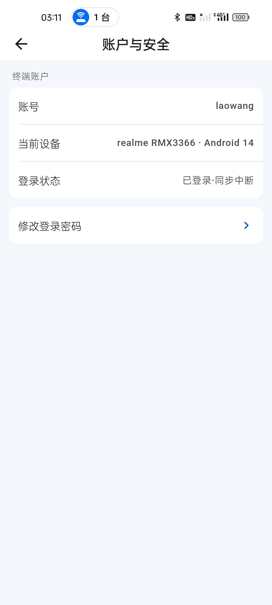
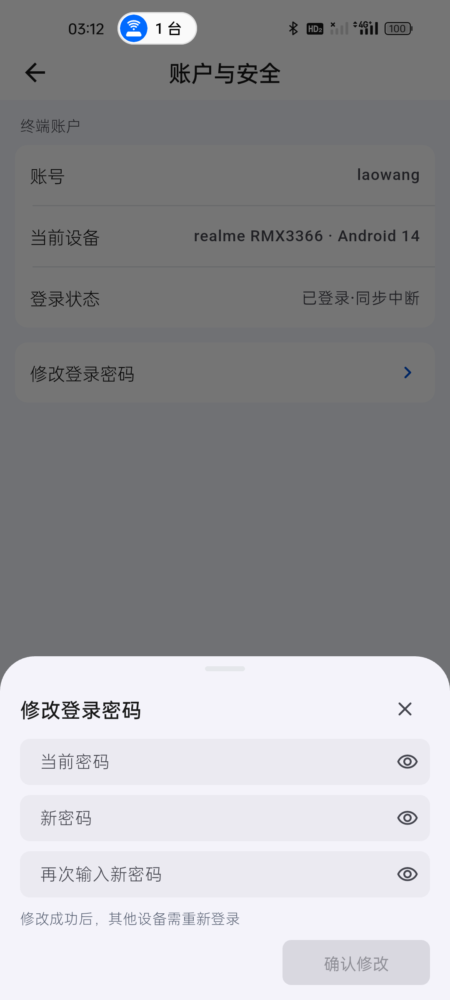
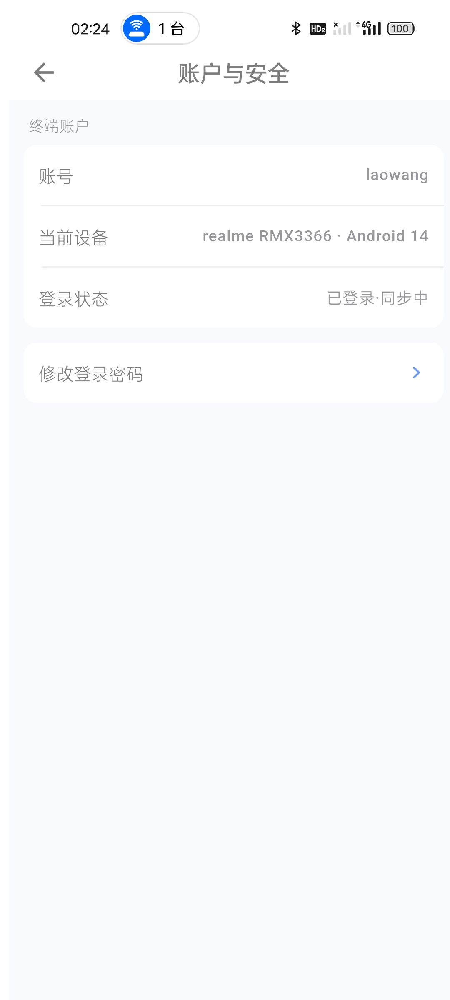
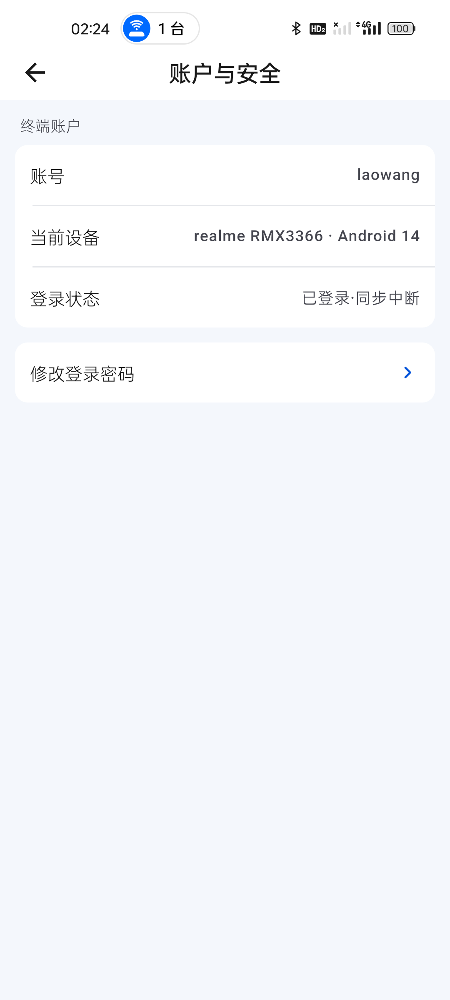
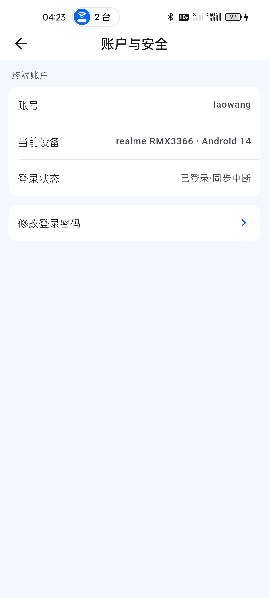
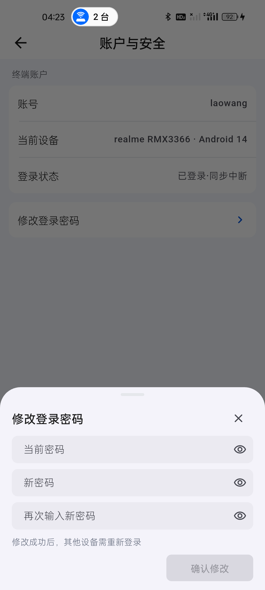

# 移动端账户与安全 / 修改密码界面复核

日期：2026-09-02  
设备：realme RMX3366（Android 14）

## 结论

用户截图中的旧结构不适合作为最终方案：设备内部 ID 不应暴露，登录状态文案不明确，修改密码表单也不应长期占据账户信息页。

当前安装版本已采用更符合移动端设置页的两层结构：

1. “账户与安全”页只展示账号、可读设备名称和真实同步状态。
2. “修改登录密码”作为独立入口，点击后从底部展开抽屉。
3. 抽屉内保留当前密码、新密码、确认密码和显隐按钮；未填写完整前主按钮禁用。
4. 修改成功后的影响明确为“其他设备需重新登录”，当前操作会话不提前退出。
5. 登录状态区分“同步中”和“同步中断”，冷启动连接阶段不再提前显示失败。

## 现场证据

### 1. 账户与安全页：通过

- 未显示设备 ID、指纹或其他内部标识。
- 当前设备显示为用户可理解的设备型号与系统版本。
- 服务不可用时显示“已登录·同步中断”，没有伪造在线状态。
- 修改密码入口独立，页面信息密度正常。

### 2. 修改密码抽屉：通过

- 使用底部抽屉，符合当前移动端 OA 交互约定。
- 输入框、按钮和间距保持紧凑，没有占满整页。
- 密码未填写完整时按钮禁用，避免无效提交。
- 密码内容未写入截图、日志或报告。

### 3. 实时状态三态：通过

- 真机冷启动后进入账户页，连接阶段显示“已登录·同步中”。
- 网络超时后同一页面原位切换为“已登录·同步中断”，不会退出登录或清空本地数据。
- Android 16 模拟器最终同样显示“已登录·同步中断”。
- 自动化分别覆盖 `connecting`、`unavailable` 和可用会话语义；账户安全定向测试 3/3 通过。

### 4. 登录设备离线入口：通过

- 服务不可用时使用单行“暂时无法同步设备”和明确重试入口。
- 没有用本地设备身份伪造服务端“已授权设备”结果。

## 限制

当前服务器不可用，本次只完成真实设备上的界面、离线状态和入口行为复核；未提交真实密码修改请求，也未验证服务端成功响应后的跨设备会话失效。

## 回归结果

- `flutter analyze`：通过，0 问题。
- `flutter test`：285/285 通过。
- `flutter build apk --profile`：通过，78,546,214 bytes。
- APK SHA-256：`EC9F841657590B4030F82053A43CF7CD65308A98134805B89BE48AD7FD871435`。
- 同一 APK 已覆盖安装 realme 真机与 Android 16 模拟器。

## 后续最终包

同日继续统一“我的”、登录设备和通知设置连接三态，并修复成员资料加载前闪现登录账号的问题。最终回归为 289/289 自动化通过、0 静态问题，Profile APK SHA-256 为 `9B9408579999A36583613011053A2B913E8257D4CCFBE39BA992196B5DBE47D7`；真机修改密码抽屉与设备同步中断状态见 `630-profile-device-sync-state-audit-20260902.md`。

本轮再次使用最新源码构建并覆盖安装两台设备，真机确认账户页不再显示内部设备 ID，修改密码仍为底部抽屉。全量回归为 293/293、0 静态问题，Profile APK SHA-256 为 `BA0D405517BEBA7E3BA6A7E33E3A368F1C111BA55B823F3194650A8E86BCD3BF`。

## 最新安装复核

- 截图中的旧整页密码表单未继续使用；真机最新版只展示账号、可读设备名称、真实同步状态和修改密码入口。
- 点击入口后从底部展开紧凑抽屉，三项密码独立显隐，空表单保持禁用；密码和内部设备 ID 均未进入证据。
- `flutter test`：300/300 通过；`flutter analyze --fatal-infos`：0 问题。
- 干净 Profile APK：69,428,260 bytes，SHA-256 为 `EBD214F58B75398C341B55F0A73B222B9344EF3384387793AE1DE243EB63550B`，已覆盖安装 realme 与 Android 16 模拟器。
