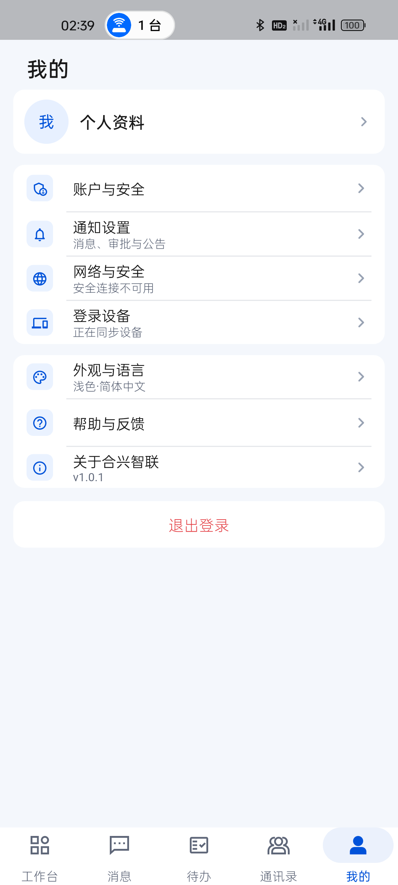
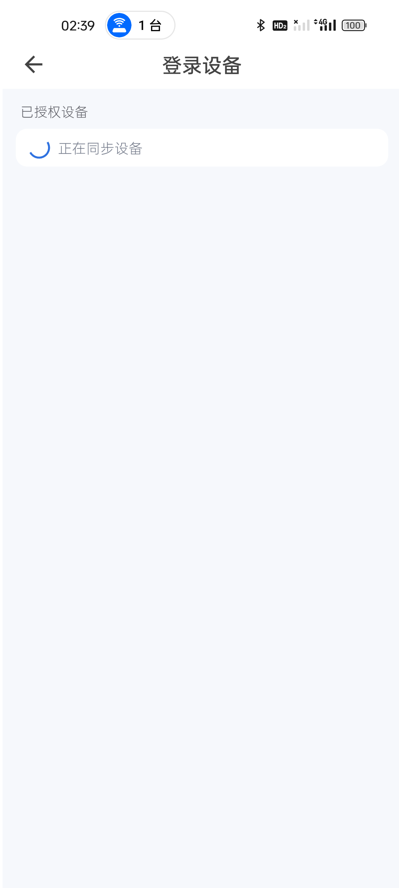
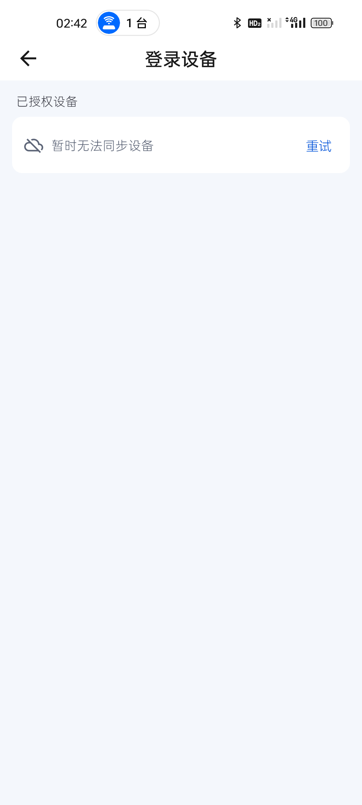
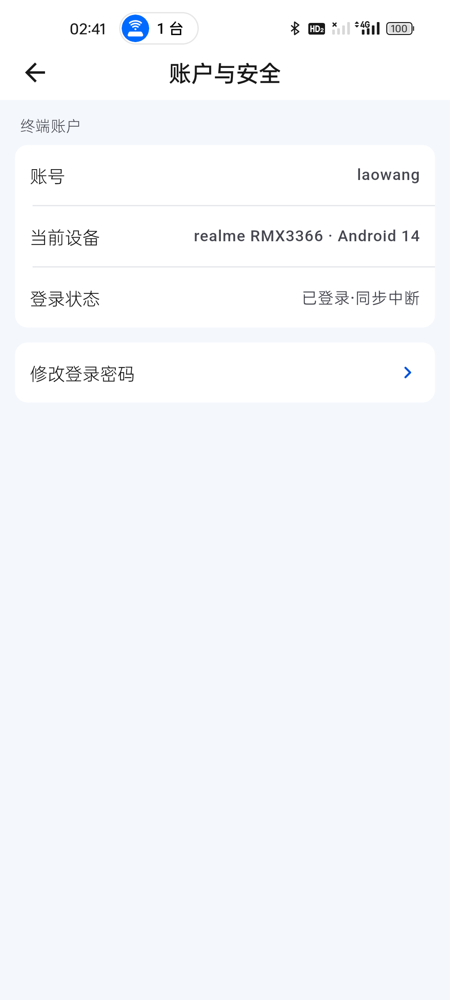
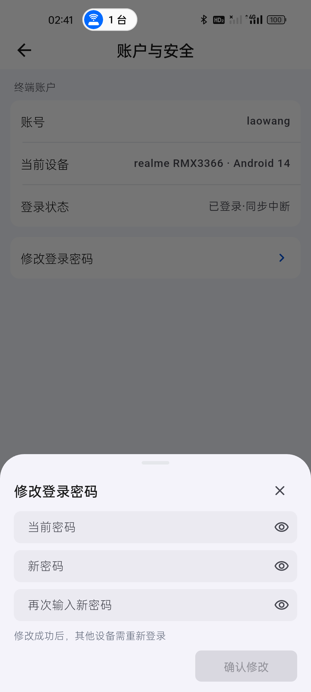

# “我的”设备同步与修改密码真机复核

日期：2026-09-02  
设备：realme RMX3366（Android 14）、Android 16 模拟器

## 结论

本轮把“我的”、登录设备和通知设置统一为真实连接三态，并再次在真机检查账户与安全及修改密码交互。

1. 成员资料尚未载入时不再把登录账号临时当作姓名显示，使用中性的“个人资料”占位；成员缓存到达后再显示真实姓名和部门。
2. 登录设备区分“正在同步设备”和“暂时无法同步设备”，连接中不提前报错，失败后不永久转圈。
3. 通知设置区分“正在连接”“连接恢复后同步”和“实时同步”，系统推送加载态与离线重试态不混用。
4. 账户与安全页只保留账号、可读设备名称、登录状态及修改密码入口，不显示内部设备 ID。
5. 修改密码使用底部抽屉，三个密码框保持紧凑；内容未完整填写时确认按钮禁用。

## 真机证据

### “我的”连接中占位

- 页面没有闪现登录账号。
- 登录设备摘要显示“正在同步设备”。

### 登录设备连接中

- 使用紧凑单行加载态。
- 连接中不显示“重试”，避免把正常启动误报为失败。

### 登录设备同步中断

- 服务超时后切换为“暂时无法同步设备”。
- 保留单个“重试”入口，不清理当前登录会话。

### 账户与安全

- 当前设备显示用户可理解的型号和系统版本。
- 服务不可用时显示“已登录·同步中断”。
- 内部设备 ID、指纹和令牌均未进入页面或报告。

### 修改密码底部抽屉

- 当前密码、新密码、确认密码分别输入，显隐控制独立。
- 页面没有大卡片表单和通栏按钮。
- 本轮只检查空表单和禁用态，没有输入、记录或提交密码。

## 回归结果

- `flutter analyze --fatal-infos`：通过，0 问题。
- `flutter test`：289/289 通过。
- `flutter build apk --profile`：通过，78,546,214 bytes。
- APK SHA-256：`9B9408579999A36583613011053A2B913E8257D4CCFBE39BA992196B5DBE47D7`。
- 同一 APK 已覆盖安装 realme 真机与 Android 16 模拟器。

## 未完成项

当前测试服务器仍不可达，因此没有提交真实密码修改请求，也不能判定服务端是否只保留当前操作会话并使其他设备会话失效；Android 实际系统推送通道仍需服务恢复并接入 FCM 或厂商推送后验收。
