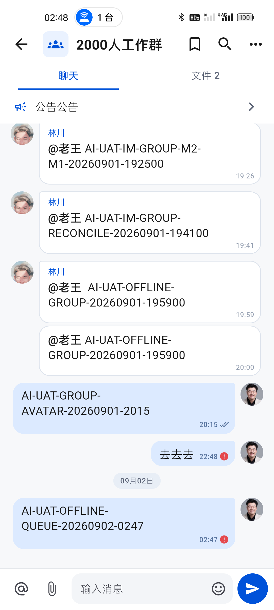
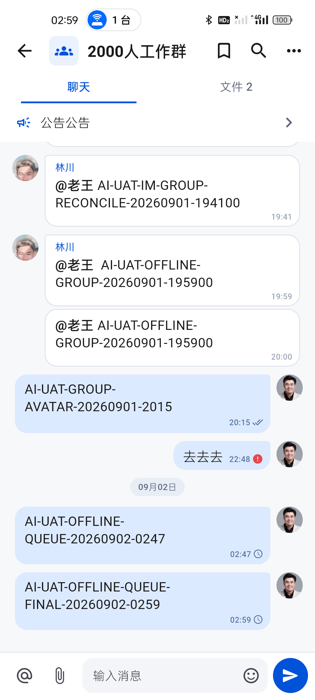

# IM 离线发送本地优先真机复核

日期：2026-09-02  
设备：realme RMX3366（Android 14）、Android 16 模拟器  
会话：真实群聊“2000人工作群”

## 结论

真机复现确认旧实现虽然把文本写入 SQLite Outbox，但发送动作仍会锁住输入框等待网络，超时后才插入消息并显示红色失败。这与“先本地落库、立即渲染、网络恢复后自动补偿”的协议不一致。

当前版本已修正：

1. 文本和联系人卡片先进入按账号隔离的本地消息表与 Outbox；普通文件及图片/视频/音频同时写入受保护文件队列，再立即返回本地 `pending` 消息，不把附件大块 Base64 写入 SQLite。
2. 输入框无需等待网络请求结束即可清空，本地消息气泡立即出现。
3. 网络断开、超时、HTTP 408/429/5xx 等可恢复错误保持时钟状态，并按退避时间自动重试。
4. HTTP 4xx 等明确永久错误才显示红色失败入口，用户可手动重试。
5. 手动重试只把消息恢复为 `pending` 并唤醒同步协调器，不在前台阻塞等待网络。
6. 进程强制停止后，排队消息从 SQLite 恢复，内容、顺序和 `pending` 状态不丢失、不重复。
7. Outbox 严格按创建顺序推进；最早消息处于退避期时，后续消息不会越过它先发送。

## 真机证据

### 修正前：网络超时后才出现红色失败

- `AI-UAT-OFFLINE-QUEUE-20260902-0247` 在旧包中等待网络结束后才进入消息列表。
- UI 语义为“发送失败，点此重试”，与仍保留在 Outbox 中等待补偿的真实状态矛盾。

### 修正后：立即出现本地排队消息

- `AI-UAT-OFFLINE-QUEUE-FINAL-20260902-0259` 无需等待网络超时即可显示。
- 输入框已清空，消息右下角使用紧凑时钟，不增加额外说明文本。
- UI 语义明确为“发送中，等待网络恢复”。

### 进程重启后仍保留

- 使用系统强制停止应用后重新启动并进入同一群聊。
- 两条排队消息仍在原顺序位置，均保持 `pending`，没有重复气泡。
- 群聊头像、连续消息分组、日期分隔和单聊/群聊边界未回退。

## 自动化与构建

- 新增本地仓库用例：文本、文件、联系人卡片均先返回 `pending`，且 Outbox 中存在对应记录。
- 新增错误分类用例：连接错误和 HTTP 503 可重试，HTTP 400 为永久错误。
- 新增存储用例：可恢复失败退避期间消息保持 `pending`。
- 新增 FIFO 用例：最早消息退避时阻塞后续消息，手动恢复后按原创建顺序返回待发送队列。
- 新增消息语义用例：时钟状态对辅助功能暴露“发送中，等待网络恢复”。
- IM/Outbox 定向回归：53/53 通过。
- `flutter test`：300/300 通过。
- `flutter analyze --fatal-infos`：0 问题。
- `flutter build apk --profile`：通过，91,670,851 bytes。
- APK SHA-256：`593ABB0F23591BB484B262AB297ABD88A3AD59AA723EE73E2A4D10430553A13F`。
- 同一 APK 已覆盖安装真机与 Android 16 模拟器；两端应用进程关键异常 0 条。

## 未完成项

1. 测试服务仍不可达，尚不能证明排队消息在网络恢复后由服务端确认并原位替换，也不能核对桌面端同步到达；本地状态和重启持久化已通过。
2. 图片、视频、音频和普通文件均已改为账号隔离、受保护的文件队列；真机断网排队、强停恢复、离线视频打开和应用内音频播放已通过，详见 `632-im-media-outbox-offline-audit-20260902.md`。
