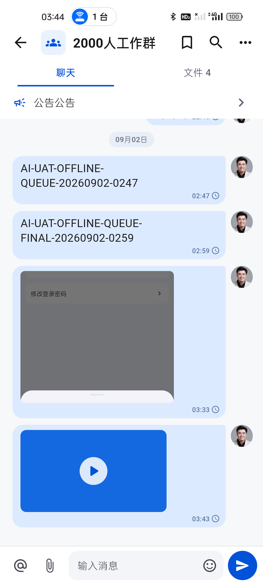
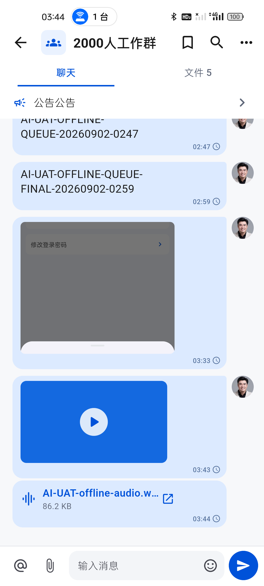
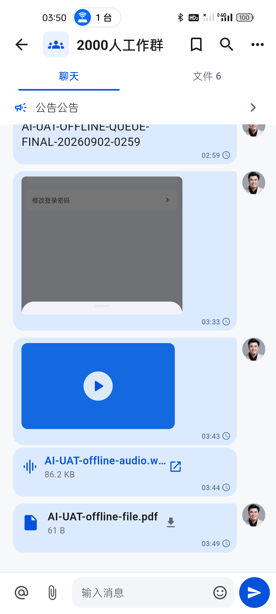
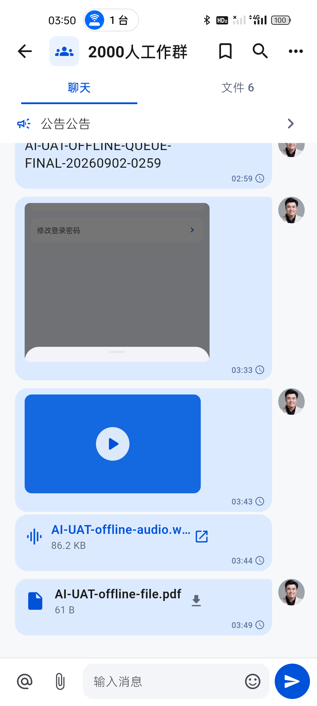
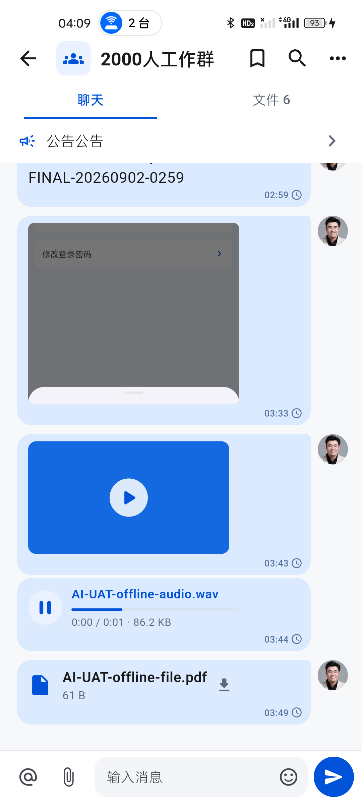

# IM 全附件离线 Outbox 与应用内音频播放真机验收

日期：2026-09-02  
设备：realme RMX3366（Android 14）、Android 16 模拟器  
会话：真实群聊“2000人工作群”

## 结论

文本、图片、视频、音频和普通文件现均采用本地优先发送。附件二进制先进入按环境和账号隔离的 AES-GCM 受保护文件队列，SQLite 仅保存加密元数据与不透明文件引用；客户端随后立即渲染 `pending` 消息，不等待网络上传，也不把大块 Base64 写入 SQLite。

真机在测试服务完全不可达时依次选择 MP4、WAV 和 PDF，三条消息均立即出现；强制停止、冷启动和覆盖安装新 APK 后，消息内容、顺序、时间、发送中状态和文件计数保持不变，且没有重复。视频可从受保护队列交给系统播放器。音频首次验收发现厂商音乐应用忽略目标文件并播放自身歌曲，现已改为应用内播放器，真机可直接播放/暂停并显示进度和真实时长。

## 实现与安全边界

1. 图片、视频、视频封面、音频和普通文件全部采用 AES-GCM 受保护文件队列；新记录不再写入附件 Base64。
2. 文件路径只保存不透明散列标识，附加认证数据绑定环境、账号、`clientMessageId`、文件标识和文件角色。
3. 跨账号读取、内容篡改和截断均失败关闭；服务端确认前不会删除本地文件。
4. 上传前完成完整认证校验，再以流式解密 multipart 上传；确认后以服务端消息原位替换临时消息并删除队列文件。
5. 旧版 SQLite Base64 记录仍可读取和补发，避免升级后遗失尚未发送的历史数据。
6. 图片和视频封面直接从受保护队列生成预览；音频从受保护队列读取后在应用内解码播放，不再依赖不可控的厂商播放器。

## 真机证据

### 三类附件断网后立即显示

- 视频显示真实首帧与播放按钮，音频和普通文件保持紧凑单行卡片。
- 三条消息均显示原选择时间和紧凑时钟语义“发送中，等待网络恢复”。
- 群聊文件数量由 3 增至 6，证明附件已进入本地消息投影。

### 强停与覆盖安装后恢复

- 强制停止、冷启动和覆盖安装后，三条附件仍各存在一条，顺序与时间不变。
- 受保护文件可再次读取，视频从本地排队文件成功打开。

### 音频改为应用内播放

- 音频卡片使用播放/暂停、细进度条、当前时间、总时长和文件大小，不显示外部打开图标。
- realme 真机播放 44.1 kHz 单声道 WAV；系统日志记录当前应用创建并启动 `AudioTrack`，完成后正常停止，`E/flutter` 与崩溃为 0。
- 播放结束后可点击重新从 0 开始，离开会话时播放器释放。

## 自动化与构建

- 受保护文件队列：明文不可见、跨账号读取失败、篡改失败、删除清理通过。
- SQLite 12 版迁移：加密附件元数据落库，旧数据库升级通过。
- 图片、视频、音频和普通文件：本地 `pending`、强停恢复、严格 FIFO、流式上传、确认替换和队列清理通过。
- 普通文件与音频：排队状态可直接从受保护文件回读，读取字节与原文件一致。
- 聊天页面：视频真实首帧、应用内音频播放器、发送中语义和头像分组通过。
- IM/附件定向回归：42/42 通过。
- `flutter test`：300/300 通过。
- `flutter analyze --fatal-infos`：0 问题。
- `flutter build apk --profile`：通过，69,428,260 bytes。
- APK SHA-256：`EBD214F58B75398C341B55F0A73B222B9344EF3384387793AE1DE243EB63550B`。
- 同一 APK 已覆盖安装 realme 与 Android 16 模拟器。

## 未完成项

1. 测试服务仍不可达，尚不能真实证明附件恢复网络后的服务端确认、临时消息原位替换、桌面端同步到达和服务端去重；本地 HTTP 协议测试已覆盖请求结构、确认替换和清理。
2. 普通文件的真机内容查看仍取决于设备是否安装对应格式查看器；客户端受保护文件回读和打开失败提示已覆盖，未把缺少外部查看器伪装成应用成功。
