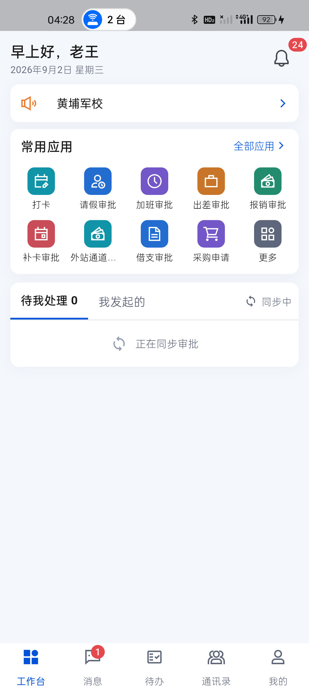
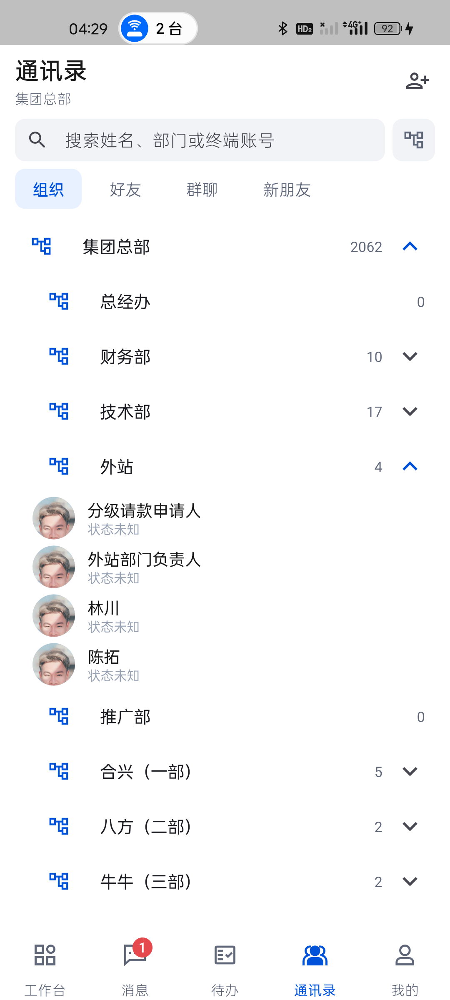
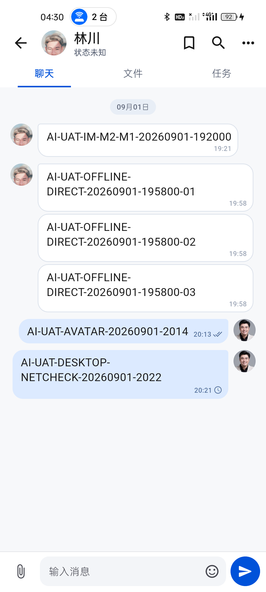
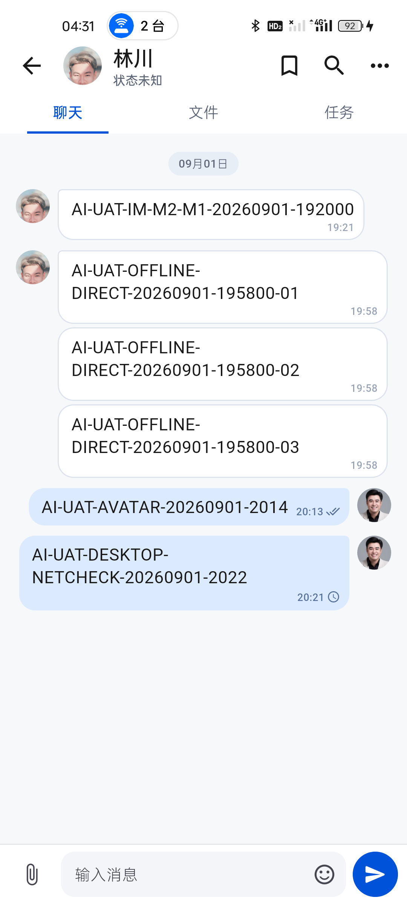

# 移动端真机启动与会话热重开性能复核

日期：2026-09-02  
设备：realme RMX3366（Android 14）  
安装包：Production Profile `1.0.1`

## 结论

当前真机启动与“通讯录头像进入单聊”路径通过本轮性能复核。此前 Android 16 模拟器出现的 3.8–6.8 秒冷启动不能代表当前真机结果；最新包在保持真实会话、IM、OA 和离线 Outbox 初始化的前提下，五次干净冷启动均小于 0.75 秒。

## 冷启动

执行方式：每轮先 `am force-stop`，再使用 `am start -W` 启动真实 `MainActivity`。

| 轮次 | LaunchState | TotalTime | WaitTime |
| --- | --- | ---: | ---: |
| 1 | COLD | 697 ms | 708 ms |
| 2 | COLD | 747 ms | 758 ms |
| 3 | COLD | 712 ms | 726 ms |
| 4 | COLD | 700 ms | 706 ms |
| 5 | COLD | 707 ms | 726 ms |

- 最小值：697 ms。
- 中位数：707 ms。
- 最大值：747 ms。
- Android 日志五次均出现对应 `Displayed ... MainActivity`，未出现 `E/flutter`、FATAL 或 ANR。
- 首屏保持真实“同步中 / 正在同步审批”，没有为了首帧速度跳过协作初始化。

## 热返回

应用驻留后台后连续十次从桌面恢复：18–44 ms，系统均返回 `Status: ok`。这项数据只代表 Activity 恢复，不等同于服务端同步完成时间。

## 通讯录到单聊

1. 通讯录默认只显示顶层组织，展开“集团总部”后按部门展示，不预先创建 2062 条人员行。
2. 展开“外站”后只创建该部门四名人员；真实在线通道不可用时统一显示“状态未知”，没有复用缓存绿点。
3. 点击林川头像直接进入已有单聊，本地消息窗口、双方头像、输入区和发送中状态立即可用；本次过渡采样 3 帧、Janky 0、Frame deadline missed 0。

## 连续重开与内存

- 连续执行 40 次“返回通讯录 → 点击同一头像进入单聊”。
- 初始聊天页 PSS：255,299 KB。
- 20 / 30 / 40 次循环时的运行中峰值分别为 267,052 / 274,280 / 280,776 KB。
- 停止操作 3 秒后 PSS 回落到 254,574 KB，低于初始值；没有持续线性增长证据。
- 全程未出现 Flutter 异常、Android 崩溃或 ANR。
- 自动化继续覆盖热缓存复用、快速重开的最新消息核对合并、最多 32 个会话窗口的有界缓存，以及已耗尽历史窗口的恢复。

## 验证边界

- 当前测试服务不可达，本轮证明的是本地冷启动、页面导航、SQLite 热缓存和渲染稳定性；不包含在线首轮同步耗时。
- `screencap` 本身有明显主机传输开销，因此截图只作为页面完整性证据，不将文件写完时间当作页面首帧时间。
- 本轮没有修改线上业务数据，也没有发送新消息。

## 同包回归

- `flutter test`：300/300 通过。
- `flutter analyze --fatal-infos`：0 问题。
- Profile APK：69,428,260 bytes。
- SHA-256：`EBD214F58B75398C341B55F0A73B222B9344EF3384387793AE1DE243EB63550B`。
- 同一 APK 已覆盖安装 realme 真机与 Android 16 模拟器。
