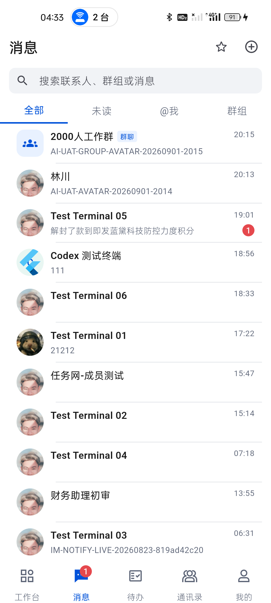
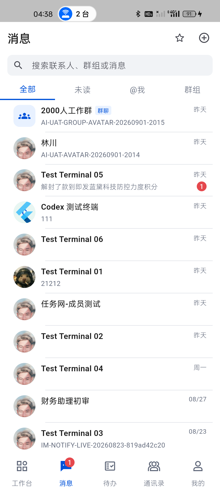

# 移动端消息列表日期语义真机复核

日期：2026-09-02  
设备：realme RMX3366（Android 14）

## 问题

最新版消息列表的群聊/单聊头像和边界正确，但所有历史会话都固定格式化为 `HH:mm`。真机在 9 月 2 日仍把 9 月 1 日消息显示为 `20:15`、`19:01`，用户会误认为这些消息发生在今天。

## 修正

会话列表时间改为按本地日期分层：

- 今天：`HH:mm`。
- 昨天：`昨天`。
- 本周更早日期：`周一`至`周日`。
- 同年更早日期：`MM/dd`。
- 跨年日期：`yyyy/MM/dd`。

时间只改变右侧标签，不改变服务端 `updatedAt`、排序或消息内容。空时间继续显示为空，不伪造当前时间。

## 真机结果

覆盖安装后，9 月 1 日的群聊和单聊统一显示“昨天”，8 月 31 日显示“周一”，8 月 27 日和 8 月 23 日显示日期。右侧列没有挤压标题、预览或未读角标，语义树同样读取到新标签。

## 回归

- 新增今天、昨天、本周、同年更早、跨年和空值边界测试。
- 消息列表定向测试：9/9 通过。
- `flutter test`：301/301 通过。
- `flutter analyze --fatal-infos`：0 问题。
- 消息列表 Golden 已人工核对后更新，日期列无布局回归。
- 干净 Profile APK：69,493,796 bytes。
- SHA-256：`685FA098F28DE5D424D9DFE2AF7F665AF80A6D3FF66B547FBA874D221A66FF61`。
- 同一 APK 已覆盖安装 realme 与 Android 16 模拟器；真机关键异常 0。

## 验证边界

测试服务仍不可达，本轮使用 SQLite 中的真实历史会话验证显示规则；没有发送新消息或修改线上业务数据。
