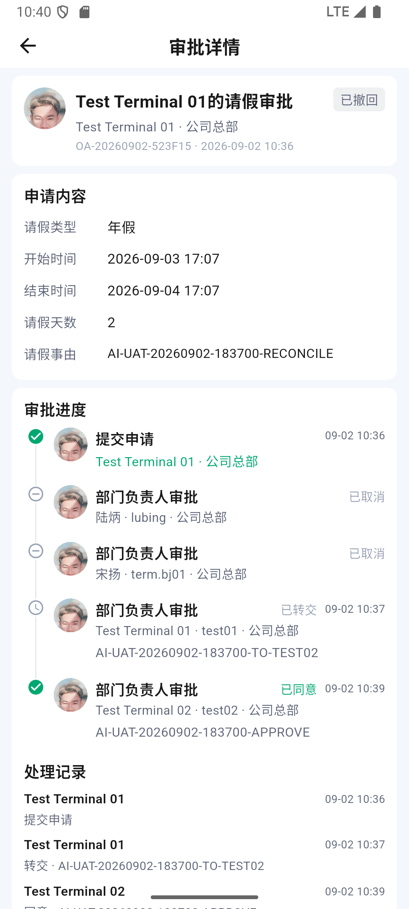
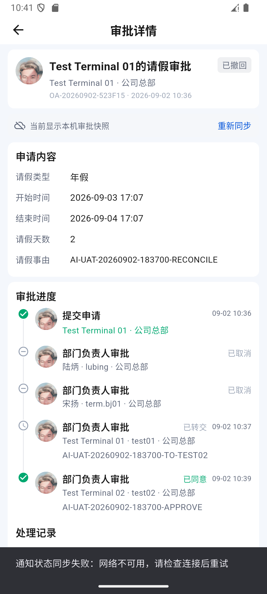

# OA 已处理人终态同步与可见详情校对

时间：2026-09-02 18:25–18:42，Asia/Shanghai。结论：**本轮客户端补偿与真实回归通过，整体目标仍为部分完成**。服务端向已处理审批人漏发后续撤回事件未被修复；没有把客户端低频校对等同于事件分发通过。

证据目录：[oa-reconcile-20260902](../test/evidence/oa-reconcile-20260902/)。上一轮记录：[647](647-oa-transfer-live-detail-and-notifications-20260902.md)。

## 1. 从未知缺口定位到服务端事件缺失

对上一轮 `OA-20260902-CBA9F3`（`cba9f30e-4def-41ac-b53f-d5212d44cd4b`），在 M2/test02 本机使用现有安全存储会话进行只读核对：

- 18:32:05，详情 GET 返回 HTTP 200，status=withdrawn、version=4，服务端撤回时间 18:21:49。
- 从 afterSequence=0 读取该账号完整 OA 事件流，最新序号仍为 **100**，共 7 条。
- 该申请匹配到序号 95 的转交通知和序号 100 的通知已读事件；没有 18:21:49 之后的撤回事件。
- M2 SQLite 事件收件箱也是 7 条，游标 **100**；上述两条目标事件都已落库。最后落库时间 18:21:27。
- 因而这一条的旧状态不是“客户端没消费已有的撤回事件”：test02 服务端事件响应本身没有撤回事件，详情接口却已更新。

完整白名单结果：[01-test02-events-and-cursor.json](../test/evidence/oa-reconcile-20260902/01-test02-events-and-cursor.json)。结论仅覆盖该测试账号、申请与观察时点，不推断所有角色/所有工作流的分发情况。

诊断入口为 `test_driver/oa_sync_probe.dart`，仅显式 Profile/Debug 构建执行，要求编号测试账号、当前测试域名、指定 UUID 和带 AI-UAT 标记的申请。使用现有登录态，不重新登录、不 ACK、不修改游标/数据库，不创建或轮换缓存密钥。事件正文仅在进程内解密并筛选目标申请，输出只含状态、事件元数据和游标，无密码、Token、设备指纹或附件地址。已恢复正常 `lib/main.dart` 构建；诊断入口未接入普通应用。

## 2. 客户端改动与性能边界

`approval_detail_page.dart` 保留 647 的定向事件刷新，增加可见详情的补偿校对：

1. 仅校对当前最上层、应用前台的未结束详情；不轮询整个待办列表或其他请求。
2. 每次刷新完成后重新计时 30 秒；收到事件后的刷新会推迟下一次补偿请求，已有请求仍串行合并，不并发叠加。
3. 切后台取消计时，返回前台对当前未结束详情立即核对。被其他页面覆盖时不发周期请求；页面销毁时取消计时和生命周期监听。
4. 已通过、已完成、已驳回、已撤回、已终止、已取消等终态不继续周期校对；仍保留已有事件驱动和手动刷新。
5. 常规后台校对不先切换“正在同步”，避免闪动和反复隐藏操作区。真实请求失败时保留已有快照、标记同步不可用，并继续按间隔恢复，不弹重复错误框。
6. 最新详情仍先写 SQLite，再使界面读取新投影。无事件时不再要求已处理人手动下拉才能看到终态。

30 秒是请求完成后的校对间隔，不是任何网络条件下的严格端到端时限；网络耗时另计。它是客户端容错措施，不能替代服务端正确分发事件，也不能保证后台通知/系统推送交付。

## 3. 新申请真实回归

M1：realme RMX3366 / Android 14 / test01。M2：Android 16 模拟器 / test02。D1：Windows 1.0.87 / test01，只读 GET 核对，不宣称桌面窗口点击验收。

申请号 **OA-20260902-523F15**，ID `523f15b1-6bf7-464e-a647-6390fdebf0fc`，事由 `AI-UAT-20260902-183700-RECONCILE`。

- 默认请假、年假、2026-09-03 17:07 至 2026-09-04 17:07、2 天，无附件。
- templateVersion=1，workflowKey=`system.default.attendance.leave`，请求 version=4。clientRequestId=`72593174-0ef6-449b-b69a-924b72665081`。
- 标题由产品生成；AI-UAT 前缀在事由，不改变已有表单约定。
- 创建与转交在上一正常包完成；**同意、撤回及自动更新观察均在最终新包安装双端之后完成**。

| 动作 | 服务端时间（UTC+8） | 操作与结果 |
| --- | --- | --- |
| 提交 | 18:36:46 | M1 真实表单提交；本轮标记只匹配 1 条申请（03） |
| 转交 | 18:37:43 | M1 只把自己的任务转给 test02，意见 `AI-UAT-20260902-183700-TO-TEST02`（04） |
| 同意 | 18:39:22 | M2 实际点击同意，意见 `AI-UAT-20260902-183700-APPROVE`；仍为整体审批中，提示当前节点同意、继续流转（05、06） |
| 撤回 | 18:40:13 | M1 实际撤回，原因 `AI-UAT-20260902-183700-CASE-CLOSED`（07、08） |
| 自动更新观察 | 18:40:39 起取证 | M2 从同意后一直留在同一详情，未下拉、未重开、未点击通知；显示已撤回，两位未处理会签人已取消，保留转交和同意历史（09） |
| 断网冷启动 | 18:41 | M2 关闭 Wi-Fi/数据、确认无默认网络，强停后重新打开；从原转交通知进入相同申请，仍为已撤回和已取消，明确显示本机审批快照（10） |

服务器动作/任务 ID、时间和权限见 [08-server-final-state.json](../test/evidence/oa-reconcile-20260902/08-server-final-state.json)。HTTP 请求编号未返回，保留 null，不伪造。

本次仍未代替宋扬/陆炳操作，不修改默认流程。剩余两位任务最终 canceled；test01 原任务 transferred，test02 新任务 approved，全部 canOperate=false。测试结束没有留下这条申请的待审批任务，也没有删除历史。

断网截图的“通知状态同步失败”是打开未读通知时标记已读失败的既有提示，不是详情加载失败；不能据此把该通知的服务端已读认作成功。本轮验证的是审批详情终态持久化。

## 4. 自动化与最终产物

- 新增 5 项 Widget 回归：无事件自动校对并在终态停止、后台暂停/前台立即校对、被其他页面覆盖不请求、事件刷新推迟补偿且不闪操作区、失败保留快照并无弹窗恢复。
- 定向 11/11，全量 **353/353**，静态分析 **0 问题**。未重录视觉基线。
- 正常入口 `lib/main.dart` Profile APK，1.0.1+2，arm64/x64，82,544,963 B。
- SHA-256：`2F21F2BFC2DA1C9BA13CF2A7DBA2E4E0869AA37B56ECD37B29FE284BA265F62E`。
- 两端实际 base.apk 哈希均相同。当前进程保留日志中 FATAL EXCEPTION、Unhandled Exception、RenderFlex overflowed 命中均为 0，不据此宣称长期性能达标。
- 模拟器 Wi-Fi/数据恢复 1/1，默认网络 106；真机保持 Wi-Fi 0、数据 1、默认网络 107，未中断其热点共享。
- [11-final-runtime.json](../test/evidence/oa-reconcile-20260902/11-final-runtime.json) 包含最终设备、包、网络和运行核验。
- 已清理本轮创建的临时回退 APK 副本（82,544,963 B，直接删除），保留正常最终 APK、源代码和全部验收证据，未删除用户原有资料。

## 5. 未完成项

- 服务端向已处理人漏发后续终态事件仍为 P1，客户端可见详情校对仅消除了本轮页面长期停留旧状态的问题。系统推送、后台终态通知未因此验收通过。
- 全体会签、或签、复杂金额分支、前后加签、办理/付款/抄送仍需独立测试流程或可用新环境管理后台；当前默认流程包含非测试审批人。
- 群历史 405、接收端群事件缺失、图片/视频/OA 附件 500 沿用前轮记录，本轮未重新证明其恢复。
- 真机原 OA 附件待同步、图片待发送和模拟器视频待发送记录保持，不复制、不删除。
- 当前工具上下文没有 computer-use 所需的 node_repl/sky 调用入口，因此本轮不提供最新 Windows 窗口操作结论；没有调用非官方替代助手。
