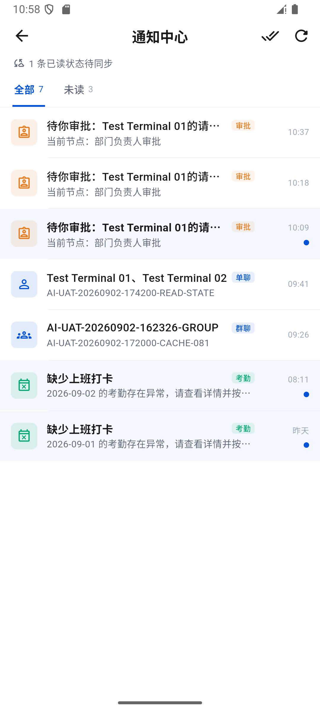
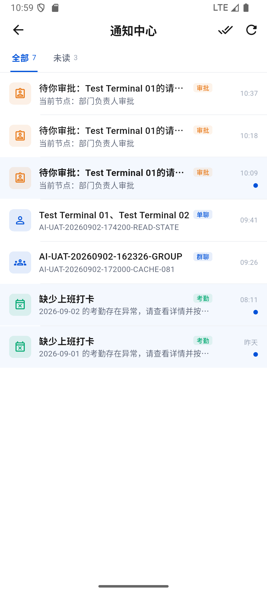

# 通知离线已读、补传与 IM 可见已读边界

时间：2026-09-02 18:43–19:02，Asia/Shanghai。结论：**本轮 OA 单条通知离线已读与补传通过，整体移动端目标仍为部分完成**。不把通知中心已读等同于系统推送送达，也不把这次修复认作高级审批流程通过。

证据目录：[notification-read-20260902](../test/evidence/notification-read-20260902/)。上一轮：[648 详情终态校对](648-oa-visible-detail-reconciliation-20260902.md)。

## 1. 问题与修复

- 648 断网进入已有审批快照时，详情可用，但直接调用通知已读接口失败，出现“通知状态同步失败”。此前无法可靠保存本机已读意图并联网补传。
- 另一个代码确认的问题：从 IM 通知打开会话时，通知层预先按最后消息序号标记整段会话已读；页面跳转不等于消息已经进入可见区域。
- OA 数据库升级到 v3，增加按账号隔离的 `oa_notification_reads`。单条已读先持久化，再更新本机展示，网络补传异步执行；不阻塞详情进入，不混入审批表单待同步队列。
- 已读回执在服务端确认后保留为 sent，列表、bootstrap、分页及缓存读取统一覆盖旧未读快照，避免迟到响应使已读反复变回未读。只查询当前页相关 ID，SQLite 参数分批处理。
- 补传合并并发调用；临时网络错误、5xx、401 保留回执并退避重试，批次遇共同故障时停止继续空发。永久失败保留为待解决记录，手动刷新可重试；不保存原始错误或敏感请求内容。
- IM 通知点击不再自行提交会话已读，交由聊天页已有的实际可见消息判定处理。好友申请边界不变。
- 通知中心仅在有未确认回执时显示紧凑的“1 条已读状态待同步”，确认后自动消失。已加载的后续分页条目返回后同步为本机已读。

主要文件：`oa_local_store.dart`、`collaboration_repositories.dart`、`oa_catalog_sync_coordinator.dart`、`notifications_page.dart`。

## 2. 真实断网验收

M2：Android 16 模拟器，test02。M1：realme RMX3366 / Android 14，test01。M1 热点共享保持，未关闭其网络。仅关闭 M2 Wi-Fi 与移动数据并核对 `Active default network: none`。

复用既有测试申请 **OA-20260902-523F15**，ID `523f15b1-6bf7-464e-a647-6390fdebf0fc`，事由 `AI-UAT-20260902-183700-RECONCILE`。其终态已撤回、version=4；本轮未重新提交、同意、撤回或修改该申请。

目标通知 ID：`ea72f7f2-6954-474b-b35a-7bd8321fea70`，类型 `approval.task.created`，创建时间 18:37:43。

| 阶段 | 真实操作与结果 | 证据 |
| --- | --- | --- |
| 初始 | 通知全部 7、未读 4，目标未读 | 01、04 XML |
| 离线打开 | 断网点击目标，进入已撤回详情；显示本机审批快照 | 05 XML |
| 返回通知 | 全部 7、未读 3、1 条已读状态待同步；没有通知同步失败弹窗 | 06 PNG/XML |
| 断网强停重启 | 冷启动后再次打开通知，仍为 7 / 3 / 待同步 1；本机已读未丢失 | 07 PNG/XML |
| 恢复网络 | M2 Wi-Fi/数据恢复，页面保持；未点刷新或全部已读 | 08 PNG/XML |
| 自动补传 | 待同步提示消失，全部 7、未读 3 保持 | 09 PNG/XML |
| 服务端核对 | 通知 GET 200，目标 isRead=true，readAt=18:59:12 | 10 JSON |
| SQLite 核对 | 同一回执 read_at=18:53:57、state=sent、attempts=5；序号 139 的已读事件已入库，本地/服务端游标同为 139 | 10 JSON |
| 普通包恢复 | 原正常入口包重装后目标继续已读，无待同步；新收到 19:00 在岗确认，故总数增至 8、未读 4，不是目标变回未读 | 12 PNG/XML |

设备时间与服务端时间有约数秒偏差，JSON 保留各自原始时间，不以跨时钟的毫秒差作为性能结论。attempts=5 是持久化的失败尝试次数，不代表发送了 5 条不同通知；服务端只匹配到一条目标已读事件。

最终服务端与本地证据：[10-server-and-sqlite.json](../test/evidence/notification-read-20260902/10-server-and-sqlite.json)。诊断入口只用当前测试会话 GET 核对与只读数据库查询，不新建会话、不 ACK、不写数据库、不输出 Token/密码/指纹/附件地址。之后恢复了正常 `lib/main.dart` 包。

## 3. 异常观察：没有忽略登录失效

第一次断网尝试进入了“登录已失效或已到期”页（03 PNG），**该尝试不算通过**。恢复网络后使用安全保存的 test02 凭据重新登录，完整重做上述流程，未再次出现退出登录。

代码中该提示来自受管终端命令接口返回 401、且恢复会话失败后的退出路径；普通网络异常本身不走这个分支。但本次没有保留当时具体请求和 401 响应证据，不能断言是自然到期、撤销，或排除并发在途请求导致的错误退出。该原因仍需专项复现。

收尾时 M1 在登录页，未观察到它退出的具体原因；使用其安全保存的 test01 凭据恢复登录，通知页正常。随后 D1/test01 的只读 bootstrap 与列表均 HTTP 200，说明此次移动重新登录后桌面会话仍可用（14 JSON），不等于完整 Windows UI 验收。

两端收到新的在岗确认；M1 仅关闭自动展开抽屉，没有点击确认在岗或无法响应。本轮未操作新出现的 18:57 补卡申请。

## 4. 自动化、包与最终状态

- 新增回执测试 8 项：无网络先落库/冷重开、旧快照覆盖、ACK 幂等、500 退避重试、账号隔离、并发合并、403 保留与显式重试、v2 数据库升级。
- 新增 IM 通知跳转不触发仓储已读测试；既有目标先打开、OA 通知分页测试同步回归。
- 本轮重新运行全量 **362/362 通过**，静态分析 **0 问题**。未重录视觉基线。
- 正常入口 Profile APK，1.0.1+2，arm64/x64，82,544,963 B。
- SHA-256：`C479502883EDF717508C83FBDDFC2FEDCBDCC0210596229B0AAE05F6AC028F8C`。
- 两端实际 base.apk 同哈希，当前进程保留日志中 FATAL EXCEPTION / Unhandled Exception / RenderFlex overflowed 均 0；不据此宣称长期性能达标。
- 最终 M2 Wi-Fi/数据 1/1、默认网络 108；M1 0/1、默认网络 107，热点共享不变。[11-final-runtime.json](../test/evidence/notification-read-20260902/11-final-runtime.json)。真机实际通知页见 [13-real-device-final.png](../test/evidence/notification-read-20260902/13-real-device-final.png)。
- 只删除本轮生成的临时回退 APK（82,544,963 B，直接删除，不经回收站），正常 APK 与同内容原包仍保留；源码、用户资料及证据未删除。
- 用户要求的应用图标保存为独立设计稿，本次没有替换启动图标。

## 5. 未完成项与边界

- 本次真实通过的是 OA **单条**通知离线已读；离线“全部标为已读”仍使用既有行为，未在本轮补齐或宣称通过。
- IM 通知不提前已读已由代码和自动化验证；本轮未增加真实未可见消息的精确时序取证。跨端真实阅读证据沿用 645，不能用本轮 OA 结果替代。
- 登录失效观察仍需请求级证据；系统推送、后台长时间恢复未在本轮完整覆盖。
- 服务端已处理人终态事件漏发、群历史 GET 405/接收事件缺失、媒体及 OA 附件 500 仍沿用前轮问题，本轮未证明恢复。原待发送/待同步记录保持。
- 全会签、或签、金额分支、加签、办理/付款/抄送仍需独立测试流程或新环境管理配置，不代替非测试审批人操作。
- computer-use 技能已核对，但当前缺少它要求的 node_repl/sky 入口；本轮为 Android 实际 UI 操作及桌面会话只读核对，没有 Windows 窗口点击证据。

总体目标保持进行中。
