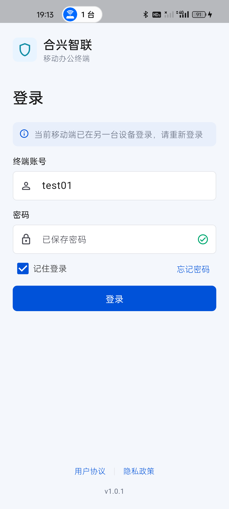
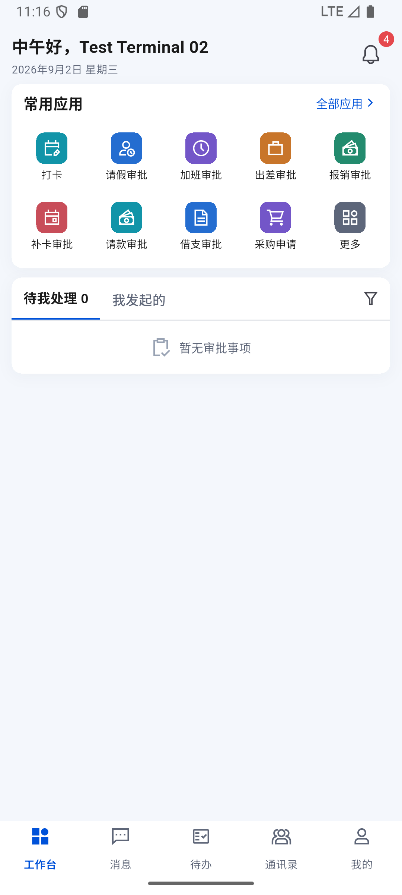

# 登录响应归属、断网恢复与真实设备替换

时间：2026-09-02 19:03–19:19，Asia/Shanghai。结论：**已复现并修复旧请求退出新会话的问题；真机与模拟器双向替换通过。整体 IM/OA 目标仍未完成。**

证据目录：[session-response-isolation-20260902](../test/evidence/session-response-isolation-20260902/)。前序异常：[649 通知离线已读](649-notification-offline-read-replay-20260902.md)。

## 1. 已证实的问题与边界

原来的受管命令、心跳、IM 同步及授权站点异常路径没有核对失败请求实际使用的会话。它们收到 401 后，可能清除当时已经更新的新会话；仅比较账号或设备 ID 也无法识别同账号重新登录。

新增确定性回归：挂起旧会话的命令请求，保存一个新会话并更新登录状态，再让旧请求返回 401。修复前两个场景（换账号、同账号重新登录）均失败：预期新会话仍存在，实际安全存储已被清空。修复后通过。

这证明代码存在真实竞态，但**不反推 649 那一次退出必然由此引起**。649 当时缺少请求级证据，最初退出原因仍不能确定。

## 2. 修复

1. 统一 `handleSessionFailure`：只处理当前请求凭据对应的 401 或 `409 + session_replaced`。比较请求中实际 Bearer 凭据、设备记录与当前会话；过期请求的结果不会清空新登录，也不显示失效提示。
2. 安全存储的会话读写串行化；增加同一临界区内的 compare-and-clear / compare-and-replace。新登录保存后，旧退出或旧刷新不能删除、覆盖其 Token 或推送令牌。
3. 兼容刷新按原会话合并请求。新登录/主动退出后到达的旧刷新结果不复活旧账号；刷新网络错误和 5xx 保留会话、等待重试。无刷新令牌时不伪造续期，当前 401 仍要求重新登录。
4. 受管命令启动和停止增加生命周期代次检查。停止期间返回的旧请求不重新建立轮询，也不执行旧命令退出新账号；远程退出包含异步推送注销时，结束后再次确认是否已有新会话。
5. 心跳、命令及站点请求固定其设备快照对应的凭据。公共请求拦截器不再把已经固定的旧请求凭据替换成新账号凭据。
6. 增加白名单诊断元数据：仅记录接口类别、HTTP 状态与处理结果，不记录请求头、账号、设备 ID、密码、Token、指纹、查询参数或响应正文。

涉及 `auth_controller.dart`、`secure_session_store.dart`、`api_client.dart`、`managed_security_repository.dart`、`mobile_presence_coordinator.dart`、`im_sync_coordinator.dart`、`managed_sites_repository.dart`。

## 3. 自动化

[01-automated-regression.json](../test/evidence/session-response-isolation-20260902/01-automated-regression.json) 对应 `test/session_response_isolation_test.dart`：

- 修复前 0/2，修复后新增 **14/14**。
- 覆盖同/异账号旧 401、当前并发 401 只退出一次、真实替换分类、无匹配凭据、网络/5xx/其他 409、原子存储、固定请求凭据、停止中的旧请求，以及刷新与重新登录/退出/并发/503/拒绝交错。
- 全量 **376/376**，静态分析 **0 问题**。没有重录视觉基线。
- 刷新令牌测试是兼容协议的本地用例，不以此认定当前服务端令牌响应或 12 小时到期已被验收。

## 4. 真机 / 模拟器实际操作

M1：realme RMX3366，Android 14，test01。M2：Android 16 模拟器，开始/结束 test02，中途临时登录 test01。D1：当前 Windows 1.0.87，保持 test01，只读核对，不主动重登。

所有移动端登录和退出均由真实页面触发，没有直接登录 API 代替。密码从已授权测试应用保存的凭据在进程内传入密码框，不写入代码、报告或截图。未提交审批、发送消息、修改密码、确认在岗，也未处理已有补卡申请。

| 场景 | 实际结果 | 证据 |
| --- | --- | --- |
| M2 真断网并冷启动 | 关闭 Wi-Fi/移动数据，确认无默认网络；强停后仍显示 Test Terminal 02，本机快照可用，不误退登录 | 02 PNG/XML |
| 离线切我的页面 | 原账号资料可用，未弹出到期提示；随后恢复网络 | 03 PNG/XML |
| M2 从 test02 切 test01 | 19:13:18 观察到 Test Terminal 01 工作台 | 04 PNG/XML |
| M2 替换 M1 | M1 心跳记录 HTTP 409、action=terminated；登录页只有一条另一台移动设备登录提示 | 05 PNG/XML、12 JSON |
| 桌面保持在线 | 19:13:35 D1 bootstrap / page 均 HTTP 200 | 12 JSON |
| M1 重新登录 test01 | 19:14:04 工作台恢复 | 06 PNG/XML |
| 反向替换 M2 | 先记录命令接口 401 的 session_preserved，随后心跳 409 / terminated；最终一条精确替换提示 | 07 PNG/XML、12 JSON |
| 账号恢复 | 19:15:06 M2 恢复 test02；19:16 双端仍分别显示 Test Terminal 01 / 02 | 08、09 PNG/XML |
| 桌面再次核对 | 19:15:32 D1 test01 bootstrap / page 均 HTTP 200 | 11 JSON |

真实替换的退出来源这次已能区分到**心跳 HTTP 409**，不再只凭登录页推测。`session_preserved` 是当前恢复分支的结果，不等同于完整刷新令牌协议通过。上述时间是观察时间；没有伪造服务端时间或请求编号。

双向替换在哈希 `CEDC09594E237E41BED6DBB1EBF0B60AE0CA6C2F0A2D83169A9E02A16B120971` 的普通入口包执行。之后仅补充了远程强制退出完成后的轮询停止归属检查，最终产物与重装核验另列于收尾证据，不把没有执行的远程管理员命令认作已验收。

## 5. 最终产物

- 最后一次改动后再次运行全量 376/376、静态分析 0 问题；普通 `lib/main.dart` 入口 Profile 包，1.0.1+2，arm64/x64，82,544,963 B。
- 最终 SHA-256：`96C54582EB09EAD2D98C3CD88A5D4AEAF62C20CA5804E9584644BF907AA4EDC5`。
- 19:18 覆盖安装两端并强停冷启动，真机/模拟器继续分别显示 test01 / test02 的工作台，无失效提示。见 [最终模拟器](../test/evidence/session-response-isolation-20260902/13-final-package-m2.png)、[最终真机](../test/evidence/session-response-isolation-20260902/14-final-package-m1.png)。
- 两端实际 base.apk 哈希一致，当前进程致命异常/未处理异常/布局溢出命中均为 0，最终启动后的会话失败日志均为 0；不等于长期稳定性或 12 小时有效期证明。
- M2 Wi-Fi/数据恢复 1/1、默认网络 109；M1 保持 0/1、默认网络 107，热点共享不变。[15-final-package-runtime.json](../test/evidence/session-response-isolation-20260902/15-final-package-runtime.json)。
- 没有生成额外 APK 备份或删除用户数据；应用图标设计稿未替换启动资源。

## 6. 安全与剩余项

- M1 热点共享未中断；M2 网络恢复。未清空账号缓存或删除原 IM 媒体/OA 附件待同步记录。
- 真实请求晚到的“误退出”竞态由可控本地请求测试证明；没有在线故意篡改 Token 或拦截生产通信。
- D2 替换 D1、改密使其他会话失效、真实 12 小时自然到期、后台长时断网恢复、远程管理员强制退出仍未执行。
- 当前 computer-use 缺少要求的 node_repl/sky 入口；桌面接口可用不代表最新版 Windows 窗口逐页操作已完成。
- 群历史 GET 405/群事件缺失、媒体和 OA 附件 500、复杂金额分支/完整会签或签/加签/办理付款抄送仍保留，不缩减目标。
- 初次登录失效的原始根因未被追溯证明；已修复可复现竞态，并为后续真实异常增加安全取证字段。

总体目标保持进行中。
