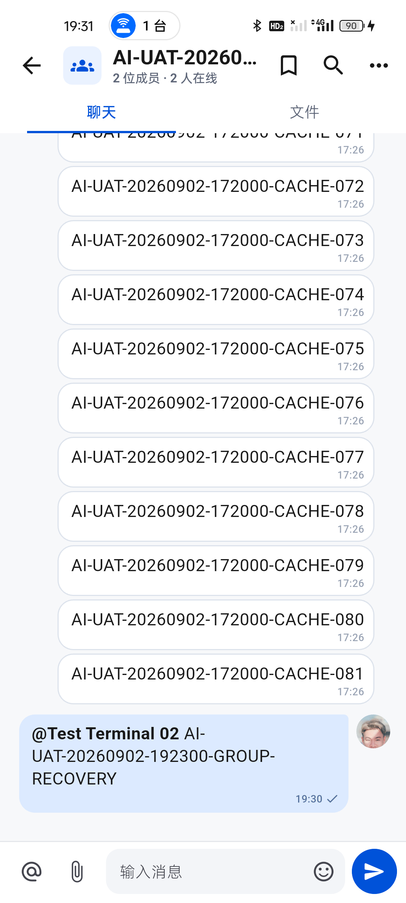

# 群历史恢复与会话发送队列隔离

时间：2026-09-02 19:20–19:32，Asia/Shanghai。结论：**历史分页恢复；已修复跨会话发送阻塞并在真机验证原消息自动补发。群消息接收落库仍未通过，不代表整体目标完成。**

证据目录：[group-recovery-20260902](../test/evidence/group-recovery-20260902/)。本轮没有再次创建目标或缩减原目标。

## 1. 先核对服务端变化

- 19:20:05 当前桌面 test01 的只读核对：bootstrap / IM events / 单聊和群聊历史均 HTTP 200；历史为 application/json 数组，不再是之前的 GET 405。没有把 GET 改为 POST，也没有修改服务端。
- 群 `c4906953-10bd-4671-b984-c50ed3951349` 初始 84 条；最新页 50 条、序号 35–84。真机从最新消息连续向下拖动列表以查看更早消息，无需点“加载更多”，最终显示 16:24 的首条 @ 消息、16:33 / 16:40 消息和 CACHE-001。
- 19:22:24 核对群 lastReadSequence=84、unreadCount=0。初始桌面读数为 lastRead=51 / unread=33；不把只显示最新页当作完整分页成功。
- 相关证据：01 JSON；02 初始历史；03 更早历史；04 首条历史 PNG/XML。

## 2. P1：一个单聊图片失败，阻塞其他群聊发送

### 真实复现

1. 真机 test01 先前有一条单聊图片等待重试，其图片发送返回 HTTP 500。
2. 19:23:30 在真实群聊使用成员选择器选中 Test Terminal 02，发送一次 `@Test Terminal 02 AI-UAT-20260902-192300-GROUP-RECOVERY`。
3. 群消息一直显示等待发送；19:26:34 服务端最新仍为 84，找不到该消息。
4. 长按原消息，在底部抽屉点一次“立即重试”，没有重新编辑或复制发送。仍无服务端记录。
5. 真机 SQLite 只读一致快照证明：旧图片 attempts=18，后来为 19；新群文本 attempts=0。图片的 nextRetryAt 在未来，新群消息根本未发出请求。

预期：不同会话各自发送，同一会话内顺序不变。

实际：`dueOutbox` 对整个账号遇到首个未到重试时间就停止；`flushOutboxDetailed` 遇到任何暂时性失败就终止整个批次。一个图片端点故障因此堵住其他会话。

证据：[07 待发送界面](../test/evidence/group-recovery-20260902/07-m1-blocked-before-fix.png)、[08 队列元数据和修复前测试](../test/evidence/group-recovery-20260902/08-before-fix-outbox.json)。不能把这个客户端队列问题误报成新群文本 POST 返回 500；修复前该文本请求未发送。

### 修复

- `im_local_store.dart`：重试等待按账号 + 会话隔离；SQL 在 LIMIT 50 之前过滤阻塞，防止一个会话大量待发送记录饿死其他会话。
- 同一会话的早期记录处于退避时，后续消息不能超车，即使手动重试后续记录也不绕过队头。
- `collaboration_repositories.dart`：本批次某会话端点失败后跳过该会话余下消息，继续其他会话。真实传输异常、无响应的断网情况仍结束批次，避免离线时对每个会话串行等待超时。
- 未改变 clientMessageId；未删除图片、视频、OA 附件或修改业务数据库。

### 验证

- 两个新增确定性用例修复前 0/2，修复后 2/2；相关三个文件 28/28。
- 覆盖：55 条同会话队列退避不阻塞其他会话、账号隔离、后续手动重试不超车、同批 503 后另一会话成功、重复 flush 不重复发送、恢复后原会话按先后补发且不增插重复本地消息。
- 全量 **378/378**，静态分析 **0 问题**。首次静态检查出现测试中的多余 override 提示，移除后重新跑全量及 analyze；没有遗留该提示。

## 3. 真机原消息自动补发

19:30:11 正常入口新 Profile 包覆盖安装并启动 M1；没有再次点击发送。服务端于 **19:30:18.027499** 接收原消息：

- clientMessageId：`46bce48c-c409-45ae-99ee-4942a8d31320`，与修复前相同。
- 服务端 ID：`0e25adad-cd23-4433-8b51-1a523cc393d7`；群序号 **85**；mentions 数量 **1**。
- 19:30:29 桌面只读核对中仅一条匹配消息，自己的 unreadCount=0。
- 真机 SQLite：85 条、最小序号 1、最大 85；目标消息只有一条且 local_status=sent；目标 Outbox 已删除，旧单聊图片仍在队列、HTTP 500 未消失。
- 真机重新进入群聊显示正常已发送单勾，不再显示“等待发送”；没有依据发送成功画成已读双勾。

完整只读状态：[10-after-fix-verification.json](../test/evidence/group-recovery-20260902/10-after-fix-verification.json)。

## 4. 接收端仍存在的缺口

19:31 左右对 M2 仅只读观察：test02 群会话摘要已更新到 lastMessage=85 / lastRead=84 / unread=1 / @我=[85]，但其 SQLite 消息仍为 84 条，目标 clientMessageId 不存在。此时 M2 停留工作台，并未人为打开群来触发页面历史补取。

同次桌面 test01 的持久 IM 事件流仍为最新 159，查询不到这个群的 message.created。**这证明发送恢复不等于事件/接收落库恢复**；不能由 D1 的事件流直接推断 M2 服务端流具体返回内容。后续需按接收账号事件及游标核对，验证未打开会话时消息持久化、跨端自己的消息、离线重放与 @我 清零。

M2 曾连续出现非本轮指令导致的页面切换，已向用户询问是否正在操作。未收到确认前暂停模拟器输入、发送及安装，本轮仅读取 UI 和应用数据库元数据；不能将未知来源的切页认作应用导航缺陷。

## 5. 产物和设备状态

- APK：`build/app/outputs/flutter-apk/app-profile.apk`，普通 `lib/main.dart`，1.0.1+2，arm64 / x64，82,544,963 B。
- SHA-256：`95510B8B24CB7FD639E476FF495AE66953DC2323BC58FF25F49525C78A48A6A2`。
- 19:31:35 M1 实际 base.apk 与新产物一致；test01 正常，当前进程致命/未处理/RenderFlex 异常命中 0，会话失败日志 0。只证明本次运行观察，不代表长期稳定性。
- M2 保留 650 包 `96C54582EB09EAD2D98C3CD88A5D4AEAF62C20CA5804E9584644BF907AA4EDC5`，并未伪称双端同包。
- M1 Wi-Fi=0、数据=1、默认网络107；热点共享保持。M2 Wi-Fi=1、数据=1、默认网络109。本轮没有改变任一设备网络。
- 构建仍有 secure_tunnel 插件 Kotlin Gradle 未来兼容提示，当前构建成功；未在本轮扩展升级工具链。
- 只读辅助脚本 `scripts/inspect-device-im-outbox.py` 仅读新测试环境库的一致快照、输出队列/序号/状态等白名单元数据；不输出正文、密钥、设备指纹、Token 或附件地址，临时加密页副本自动清理，不改原库。

## 6. 未完成项

- 群事件接收/未打开会话时落库与完整双端同步；模拟器新包安装后复验。
- 图片和视频 HTTP 500、OA 附件失败仍未恢复，保留原记录等待修复。
- 桌面真实窗口逐页操作仍缺少 computer-use 所需可调用入口；本轮桌面仅授权只读核对，不能替代 UI 验收。
- D2 替换、12 小时自然到期、密码变更会话失效、完整金额分支/会签或签/办理付款/抄送及系统推送仍保留原要求。

目标保持进行中。
