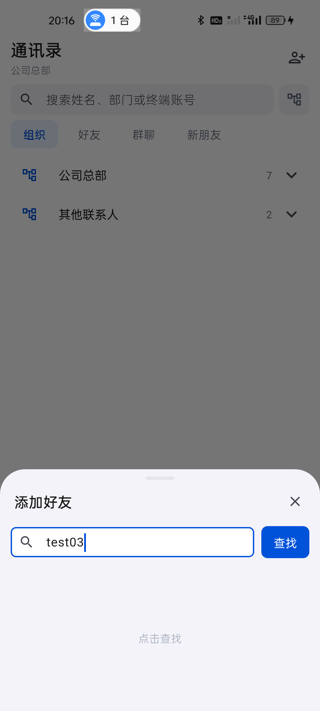
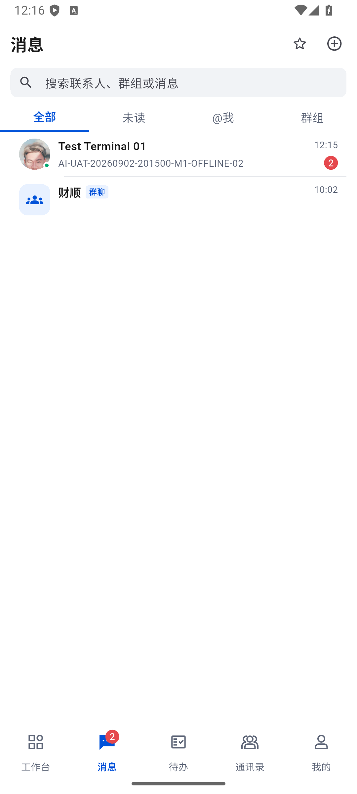
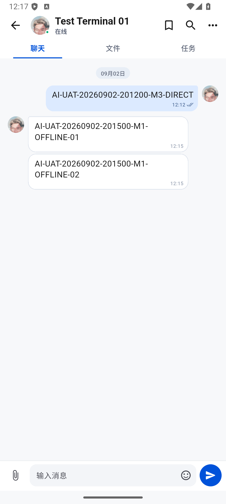

# 独立模拟器：好友链路、双向单聊与断网补齐

时间：2026-09-02 20:01–20:18，Asia/Shanghai。

结论：**本轮好友申请/接受、双向单聊、真实未读/已读、断网冷启动及后台正文补齐通过；整体 IM/OA 验收仍未完成。**

## 环境与操作边界

- M1：既有真机 Android 14，test01；网络保持 Wi-Fi=0、移动数据=1、默认网络 107，热点未操作。
- M3：新建空白 Android 16 模拟器 `SecureAccess_UAT_M3`，`emulator-5556`，test03，真实姓名显示 Test Terminal 03、部门财顺。M3 系统时区 UTC，因此截图时间比本报告北京时间少 8 小时。
- M2 `emulator-5554` 本轮没有安装、点击、登录或网络切换；不复制其 userdata、数据库或登录状态。
- D1：既有 Windows test01 会话，仅通过 GET 核对最终状态，不冒充桌面 UI 操作。
- M3 数据目录 `E:\CodexToolchains\secureaccess-uat-avds\M3.avd`，20:18 文件逻辑总大小约 2.09 GB，E 盘可用 168.15 GB。使用现有 SDK 镜像，独立目录、端口、2 GB 内存和 2 核；无界面模式运行，后续通过 ADB 操作及截图。保留该测试机继续验收，不要重建它。
- 登录凭据只在当前进程内由已有授权测试凭据读取、经环境变量传入实际登录界面，操作后清除；未输出或保存到脚本、截图和报告。

首次安装时 Android 仍未完成首次启动，包管理服务尚未就绪，安装返回 `Can't find service: package`。未重建、未重启模拟器；确认 `sys.boot_completed=1` 后正常安装成功。首次全新系统冷启动和软件渲染耗时不能当作真机性能结论。

## 最终包与本地回归

正常入口 `lib/main.dart`，Profile `1.0.1+2`，arm64 + x64。M1 和 M3 已覆盖安装，设备 base.apk 与构建产物 SHA256 均为：

`93B64B3C5A07722539CDA452DCC0D6B66F3EF46A428FA0E656996B61E55E4F19`

- `flutter test`：**403/403**，聊天/头像/单群边界/离线/会话隔离等现有回归均通过；未更新 golden。
- `flutter analyze --fatal-infos`：0 问题。首次检查的缺少大括号提示已修复并重跑。
- `git diff --check`：通过；保留既有工作区修改。
- 最终包冷启动 M1 TotalTime=1169 ms，M3=8957 ms；M3 断网冷启动=4955 ms。均真实进入工作台；M3 冷启动偏慢，仍需独立性能分析，不能凭这一轮宣布性能达标。
- 20:17 当前进程未发现 Flutter 未处理异常、FATAL 或布局溢出；M1/M3 的会话索引均持续返回 HTTP 200。

## 已修复问题

### P2：输入账号但未查询，就显示“未找到”

复现：通讯录 → 添加好友 → 输入 test03 → 尚未点击查找。旧包直接显示“未找到该终端账号”；点击后实际返回 Test Terminal 03。

现改为区分未提交、查询中、成功为空、失败四种状态。未提交显示简短“点击查找”；只有当前请求成功且结果为空才显示未找到。最终包真机截图和节点同时验证 `showsClickSearch=true`、`prematureNotFound=false`。

### P1：查询中编辑账号，按钮可能永久停留“查找中”

复现：发起尚未返回的查询 → 编辑账号。原实现只在输入值仍等于原查询时清除 loading，编辑后旧请求返回也不能解除按钮禁用。

修复：每次编辑和提交都推进请求代次；编辑解除旧 loading、清空旧结果，迟到的成功/错误/结束回调只对所属代次生效。同一个账号改走再改回也不能被旧请求覆盖。

新增两个测试：A→B、A→B→A，修复前均在“按钮仍被禁用”处失败；修复后可以发起第二次请求，第一次返回不能清掉新请求的 loading 或覆盖结果。应用冒烟专项 **27/27**。修改文件：`contacts_page.dart`、`app_smoke_test.dart`。

## 真实好友链路

1. M1 默认通讯录只显示组织；全局账号查找实际返回 test03，显示财顺部门与离线状态，不根据账号名推断角色。
2. M1 点击“申请好友”。现有 UI 不提供自定义验证消息输入，实际发送系统生成的“我是Test Terminal 01”；仅操作指定测试账号，没有新增或修改正式人员。
3. M3 首次登录时通讯录角标为 1，“新朋友”列出来自 Test Terminal 01 的申请。覆盖安装最终包后该申请仍存在。
4. M3 单独点击这条申请的“接受”，没有使用“全部接受”；新朋友清零，好友列表出现 Test Terminal 01。
5. 点击好友头像直接进入单聊，显示“聊天/文件/任务”，空消息文案为“发送第一条消息开始协作”。没有混入群聊功能。
6. M1 再查找 test03 时，操作从“申请好友”变为“发消息”；再次进入仍复用同一单聊，没有新建重复会话。

证据：[待接受申请](../test/evidence/im-independent-device-20260902/02-m3-friend-request.png)、[好友列表](../test/evidence/im-independent-device-20260902/03-m3-friend-accepted.png)。

## 三条真实消息与状态

会话 ID：`2a2ea21f-2ad6-49b3-b3da-407d1e7e4136`，类型 direct。

| 序号 | 发送方向 | 消息标识 | 服务端创建时间（北京时间） | 稳定 clientMessageId |
| --- | --- | --- | --- | --- |
| 1 | M3 → M1 | AI-UAT-20260902-201200-M3-DIRECT | 20:12:43.055 | 021ef199-d29a-46aa-8e96-c56076fe31b3 |
| 2 | M1 → M3（M3 离线） | AI-UAT-20260902-201500-M1-OFFLINE-01 | 20:15:19.283 | 068262bc-5049-40ee-b3c3-4a73c50f0ced |
| 3 | M1 → M3（M3 离线） | AI-UAT-20260902-201500-M1-OFFLINE-02 | 20:15:25.460 | 9b244492-b352-4bf6-af37-5b31247e9b32 |

### 第一条：未打开时不预读，真正显示后清零

- M3 提交后先显示发送中，服务端确认后原记录变 sent，Outbox 清空。
- M1 仍在工作台时已落 seq1 正文，lastRead=0、unread=1；总消息角标从 1 变 2。打开消息列表，test03 行显示对应正文和未读 1。
- D1 既有会话只读接口同样返回目标会话 lastRead=0、unread=1。
- M1 打开会话后正文真实可见，SQLite lastRead=1、unread=0；D1 只读接口也更新为 1/0。这里只证明服务端共享已读状态，不宣称桌面窗口角标已实际观察。
- M3 一直停留聊天页，状态自动从“已发送”变为“已有接收人已读”，没有手动刷新或重开。

### 两条离线消息：未打开会话已补正文，仍保留未读

- 仅关闭 M3 Wi-Fi 与移动数据，实际 `Active default network: none`；强制停止后冷启动仍保留 test03 登录及缓存。M1 网络未改动。
- M3 离线时，M1 在真实输入框分别发送两条不同标识的消息。M1 原来的图片上传 500 队列仍保留，但没有阻塞这个单聊的文本确认。
- 离线只读快照：M3 仍只有 seq1，M1 已有 seq1–3 且无自身未读。
- 20:15:35 恢复 M3 网络。在 M3 工作台停留、不打开消息页，不手工刷新；其 SQLite 自动变为三条，lastRead=1、unread=2、历史覆盖末序号 3。
- 随后打开消息列表，显示最后一条摘要与角标 2；再打开单聊，三条正文均可见，才更新 lastRead=3、unread=0。
- M1 两条消息随后都自动显示已有接收人已读。最终两台设备的服务端 ID、clientMessageId、序号逐条完全一致，各只有三条，没有新增重复临时消息。

只读核对脚本新增可选 conversationId、clientMessageId 和消息元数据账本参数，只查询副本，原库不写入，不输出正文、凭据或附件地址。

## 收尾与未完成项

- M3 已恢复 Wi-Fi=1、移动数据=1、默认网络 104；M1 默认网络仍为 107。两台当前均登录在线，原 M2 保持未操作。
- M3 仍在运行，后续可直接用于 M1/M3 群聊、@我、群离线补偿和真实通知验收；本轮没有执行群聊，因此不把单聊结果外推到群聊。
- 附件上传 HTTP 500 的旧图片/视频/OA 待同步记录仍未解决或删除。本轮没有重复点击发送或重建失败数据。
- 桌面 UI 控制工具仍缺失；D1 自己发送消息、桌面窗口的实时角标、D2 替换等仍需要真实 UI 证据。
- 事件落库后 ACK 前杀进程、完整推送、12 小时到期、改密失效以及独立高级 OA 流程仍待验收。
- 20:18 检查时 M3 两核软件渲染环境首次冷启动偏慢，性能目标保持未完成，不能将“无崩溃”当作性能通过。

完整证据目录：[im-independent-device-20260902](../test/evidence/im-independent-device-20260902/)。
