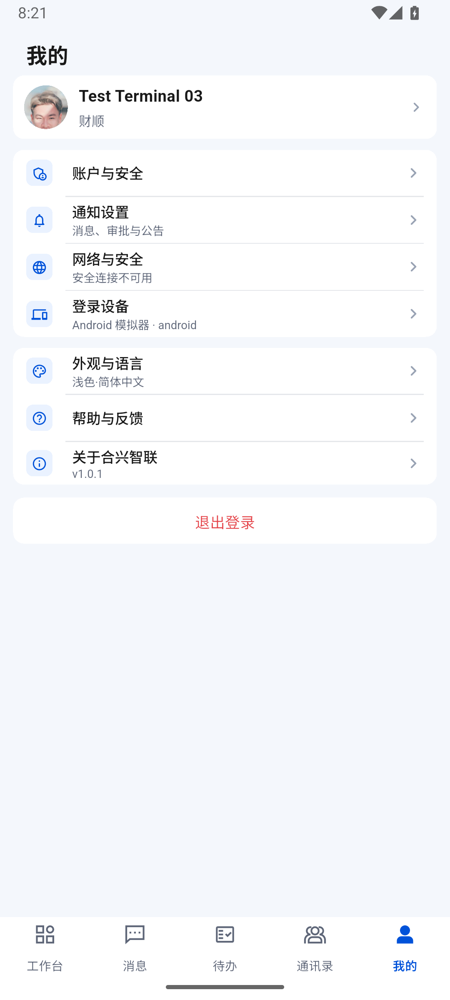
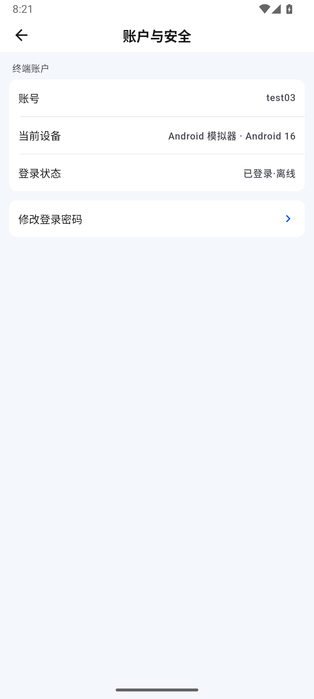
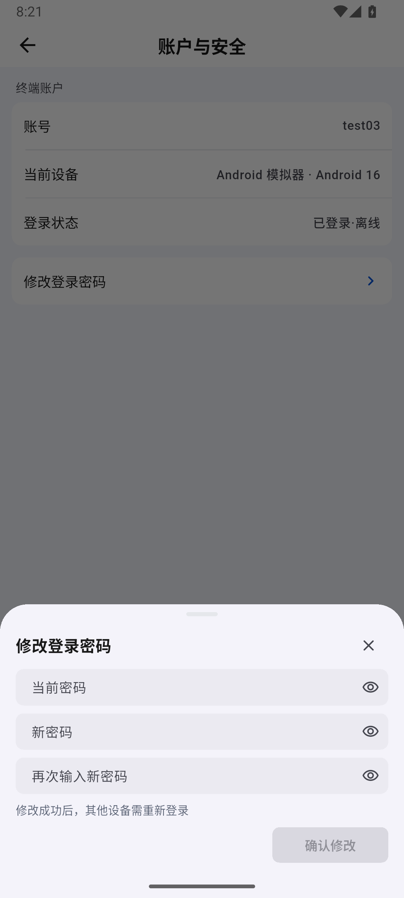
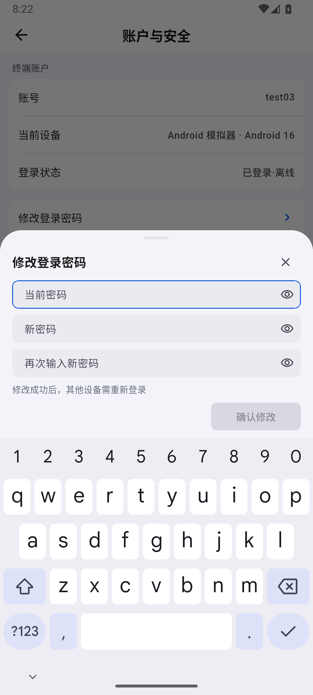
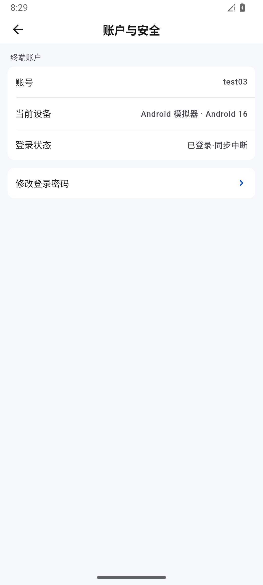

# 687 · 我的、改密交互与断网状态

## 范围与结论

**部分完成，整体目标继续。** 上一轮有最终包安装和真实数据保持证据，属于进展。本轮检查独立 M3 的“我的 → 账户与安全 → 修改密码”路径，并修复生产代码中改密结果、旧凭据与输入交互问题。不修改共享测试账号的真实密码。

使用产品体验审查技能的先截图后判断方法。技能主要面向浏览器，此处为既有原生 Flutter 应用，采用 Android ADB 真实操作及原始截图作为替代，不创建网页或新原型。没有保存新的个人记忆，没有新建 Figma 文件。

## 当前运行的页面检查

以下均为本轮实际捕获，而不是复用旧图。M3 为 test03，1080×2400；设备原有时区未调整，不用设备与主机时钟差计算性能。

1. **我的：基本正常。** 头像、部门、设置分组和五个底部入口可见，无裁切；“网络与安全”提示连接不可用，没有假装隧道在线。登录设备摘要仍为 `Android 模拟器 · android`，相比安全页具体 Android 16 信息不够一致，保留为后续细节。

2. **账户与安全：基本正常。** 使用设备名称替代裸设备 ID，状态为“已登录·离线”。网络可用不等于成员在线，不能把这张图改读为当前成员在线或登录失效；没有依据修改真实在线状态。

3. **改密空抽屉：布局正常。** 三个独立密码可见性按钮、紧凑输入框及未填写时禁用的确认按钮。没有输入或截取真实密码，密码页仅保存 PNG，不导出输入框 UI 树。初次 `05-password-empty.png` 在动画开始前抓到原页面，明确排除，不作为抽屉证据。

4. **键盘展开：布局正常，交互需修复。** 抽屉跟随键盘上移，按钮未被遮住；旧键盘动作是完成而非逐框前进。代码回归进一步发现密码可见性按钮会参与默认焦点顺序，现为前两框显式指定下一密码框，不剥夺图标的键盘访问能力。

截图仅证明该字号和屏幕的布局，不代表读屏、大字体、色彩对比度及所有设备的完整无障碍验收。

## 修复与红绿证据

[初始红测](../test/evidence/profile-security-audit-20260903/red.log) **9 项全部失败**，均已编译运行并在业务断言失败，未以编译失败替代复现。

- **P1：改密成功后旧记住密码仍保留。** 现在只删除与提交账号、旧密码都匹配的已保存凭据，保留当前访问/刷新会话；不自动保存新密码，不删除其他账号或较新登录保存的凭据。凭据写入和条件清理串行，覆盖两个竞争顺序。
- **P1：请求未固定提交会话，迟到结果可显示在新登录会话。** 请求显式固定 Authorization / X-Device-Id，禁止重定向，响应后按原会话检查 UI 归属；后续登录不显示旧成功或旧错误。没有把会话替换误当作网络错误退出新账号。
- **P2：丢失响应却断言“密码未修改”。** 接收/发送超时、连接中断、HTTP 408/5xx 以及本地总时限耗尽改为“修改结果尚未确认，请稍后核实，勿重复提交”。不输出服务端原始响应，不自动重试密码写入。明确拒绝与结果未知分开；本地凭据清理失败也不能把服务端已成功改密说成失败。
- **P2：提交中仍可编辑、返回，校验残留。** 提交期间禁用输入和可见性按钮、重复提交和返回关闭；提交过后字段实时重新校验，修改确认密码后错误立即消失。初始空表单不提前显示必填错误。前两框支持键盘下一项，禁用密码建议与自动纠错。

[生产页面](../lib/features/profile/presentation/settings_pages.dart)、[安全存储](../lib/core/storage/secure_session_store.dart)仅沿用现有外观组件，不另造视觉设计。[新增页面回归](../test/password_change_safety_test.dart) 11 项、[新增存储回归](../test/secure_session_store_test.dart) 4 项，总计新增 **15 项**。连同既有账户/存储测试，[专项最终 23/23](../test/evidence/profile-security-audit-20260903/green-keyboard.log)。

初次修复后的旧页面成功测试没有安全存储 mock，触发清理失败提示，已补齐合成存储夹具；没有为了通过测试吞掉生产清理失败。首次键盘 next 测试确实未聚焦下一密码框，后续显式焦点修复后通过，失败日志保留。

[全量 875/875](../test/evidence/profile-security-audit-20260903/full.log)；首轮分析指出新测试一处单项 cascade 风格提示，修改后重跑[专项 23/23](../test/evidence/profile-security-audit-20260903/green-complete.log)与[分析 0](../test/evidence/profile-security-audit-20260903/analyze-final.log)。风格修改仅在测试调用表达式，生产源码与全量通过时一致。没有覆盖更新 Golden，也没有运行在线密码写入。

## 最终包、键盘与断网实测

[正常 Profile 构建成功](../test/evidence/profile-security-audit-20260903/build.log)，仅 M3 覆盖安装、不清理应用数据。[APK 哈希核对](../test/evidence/profile-security-audit-20260903/install.json)本地/设备均为 `43A93AD7E9AE656E40143BCC2E51F45A708A4ADF3185256EE5F6C4416EB25C55`。

- 最终包[我的](../test/evidence/profile-security-audit-20260903/10-final-profile.png)头像正常，[账户页](../test/evidence/profile-security-audit-20260903/11-final-account.png)此时真实投影显示“已登录·在线”。没有修改在线状态来源；与首次截图不同是运行状态发生变化，不能据此推导所有在线同步问题已修复。
- [空抽屉](../test/evidence/profile-security-audit-20260903/12-final-password-empty.png)仍保持原紧凑外观。实际点按软键盘下一项，焦点从当前密码到[新密码](../test/evidence/profile-security-audit-20260903/14-final-next-field.png)，再到[确认密码](../test/evidence/profile-security-audit-20260903/15-final-confirm-focus.png)。按钮完整可见，字段均未填；13 号截图正处键盘过渡，不能作为稳定布局完成证据。
- **步骤 5，断网冷启动：通过本次范围。** Wi-Fi / 数据从 1/1 变为 0/0，强制停止后启动仍进入[缓存首页](../test/evidence/profile-security-audit-20260903/16-offline-home.png)，未读 31、缓存应用保留；[我的](../test/evidence/profile-security-audit-20260903/17-offline-profile.png)头像/部门保留，登录设备明确“暂时无法同步”。账户页显示“已登录·同步中断”，没有误报过期、清除会话或退回登录页。

- **步骤 6，恢复连接：同步提示自动恢复，在线状态仍独立。** `finally` 恢复原 1/1，[网络记录](../test/evidence/profile-security-audit-20260903/network-restored.json)时间 04:29:45；未点重试、未离开账户页，04:30:12 截图检查点前“同步中断”自行消失，此时成员状态显示“已登录·离线”。这是同一主机采样间隔内的观察上界，不是精确恢复时延，也不冒充“当前成员已在线”。

[只读前后核对](../test/evidence/profile-security-audit-20260903/preservation.json)：原 2 草稿、10 已读回执不变，OA 游标 458 / 队列 0；单聊账本、群消息相同，IM applied/acked 236，两条原媒体 Outbox 的 ID、会话、类型和创建时间相同。没有提交审批、发送消息、清空失败媒体或改真实密码。

[当前进程保留日志计数](../test/evidence/profile-security-audit-20260903/runtime-final.json)三类异常均 0，仅是 PID 20022 的有限观察，不等于完整稳定性验证。[桌面只读会话检查](../test/evidence/profile-security-audit-20260903/desktop-session.json)IM/OA GET 200，不是桌面窗口操作证据。

## 尚未证明

真实改密、另一设备因改密退出、自然会话续期后改密、服务端收到请求但响应丢失的最终密码状态，均未在线执行。本轮不宣称这些通过；结果未知仍需要服务端可核对的协议或独立测试账号端到端验证。

M1 真机接管未获新确认，M2 不操作；Windows 控制入口检索仍不可用。当前桌面仅可按已有安全助手进行只读状态核对，不能替代窗口实际操作。线上双公式、跨账号高级审批、媒体服务端错误、完整多端与推送及大群性能继续保留。
