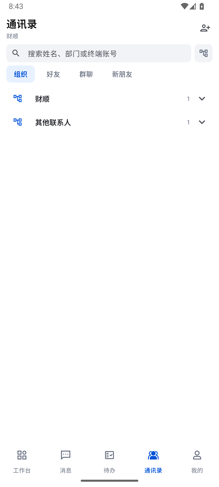
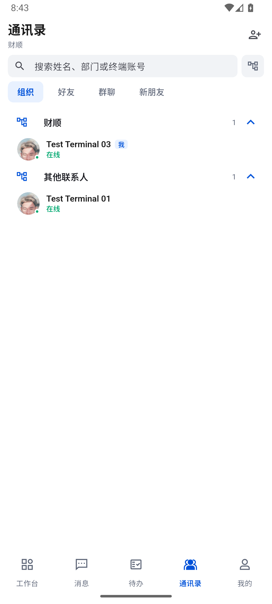
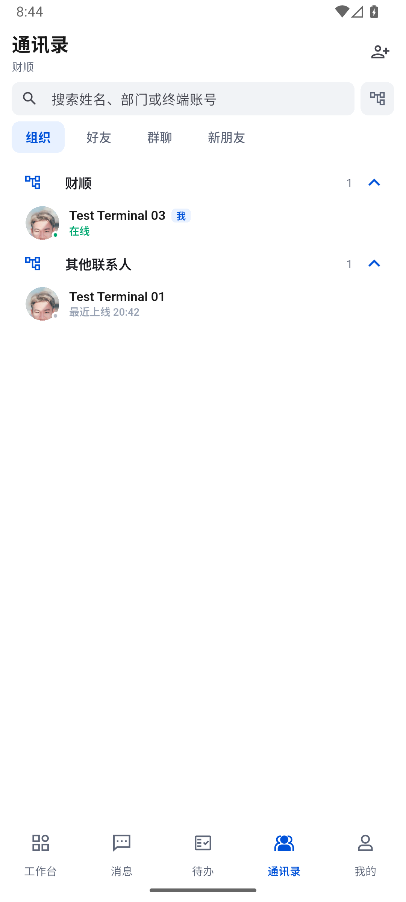
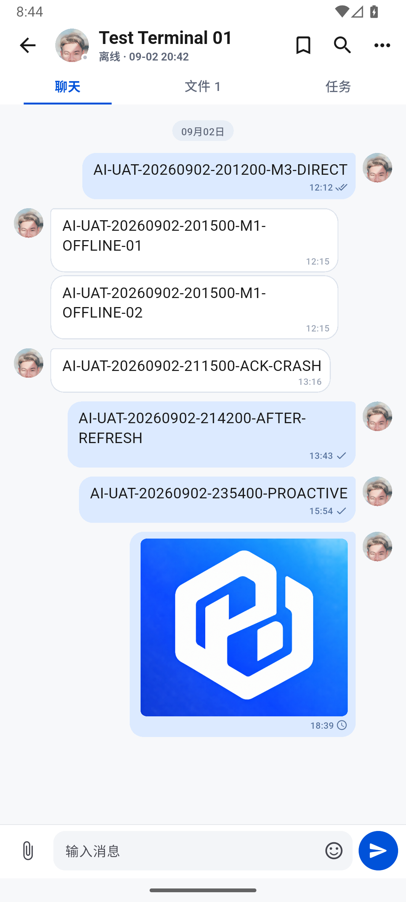

# 688 · 通讯录按可见区域渲染与运行回归

## 范围与结论

**部分完成，整体目标继续。** 承接上一轮通讯录性能修改和红绿证据继续推进。恢复工作时检查到测试已结束（55 通过、1 失败），并非仍在后台运行，没有重复启动旧进程。该失败要求已进入缓存的首位成员出现时组织标题也必须存在，与懒加载不一致；改为实际滚回组织标题，再检查展开状态与首位成员。

本轮只操作独立模拟器 M3 / test03，不操作 M1 真机、M2，不修改其他账号或远端组织，不清除应用数据。应用图标仅保留已提供的图片素材，未混入此次启动图标变更。

## 原因及修复

旧组织列表将每个展开部门的人员放在一个 `ExpansionTile.children` 内。滚到阈值就给所有展开部门增加 30 人，已加载成员仍一起保留；外层列表即使滚走，也不能单独回收该部门里的人员行。

现在将展开的组织树投影为“组织标题 / 联系人”行，外层 `ListView.builder` 逐行按可见区域构建，使用 192 逻辑像素预缓存。只有可见附近成员订阅在线状态、建立头像组件；行使用部门和成员稳定键。组织默认为收起，返回会话保留当前展开状态，搜索与模式切换按原规则重置。组织标题的展开图标跟随受控状态，避免回收重建后箭头错位。

- 保留原部门层级、顺序、人数、搜索范围及当前用户标记。
- 头像和人员行仍共用进入会话的防重入逻辑；没有重新加右侧聊天图标。
- 好友操作只在好友模式，群聊入口与组织人员保持分离。
- 真实在线状态继续使用现有统一状态源，不根据是否能联网猜测在线。
- 组织里已获取的全部人员可直接上滑到达，无额外点击“加载更多”。搜索/好友仍保留原本自动扩展窗口。
- **这是本地渲染优化，不是服务端通讯录 API 分页。** 当前接口仍获取完整目录数据；没有伪造服务端分页能力。

生产变更见 [contacts_page.dart](../lib/features/contacts/presentation/contacts_page.dart)。

## 本地可复现证据

固定 390×844 逻辑像素，用合成成员数据挂载真实通讯录页面，未连接业务接口、未把合成组织写入服务器。

| 场景 | 旧实现 | 新实现 |
| --- | ---: | ---: |
| 展开 2000 人部门后已挂载头像组件数 | 30 | 13 |
| 连续 7 次大幅滚动后已挂载头像组件数 | 240 | 14 |
| 滚到 65 人部门末尾 | 65 个头像仍挂载 | 小于 28；末位人员可达 |

“已挂载组件数”不是人数丢失，也不是实机 FPS、总内存或界面延迟。旧实现的三项有效失败见 [red-verified.log](../test/evidence/contact-virtualization-20260903/red-verified.log)。同文件还有一项旧测试定位歧义，未计入产品缺陷。后续首位成员/标题定位修正有独立 [诊断日志](../test/evidence/contact-virtualization-20260903/return-scroll-diagnostic.log)，未用放宽性能上限让测试通过。

新增 [contacts_virtualization_test.dart](../test/contacts_virtualization_test.dart) 8 项：2000 人按需构建、长滚动释放、65 人完整可达、1000 个收起组织按需构建、窗外人员搜索、滚回后的组织状态、空部门、折叠再展开无重复。

- [全量 883/883](../test/evidence/contact-virtualization-20260903/full-tests.log)。
- 初次分析发现当前 SDK 的 `cacheExtent` 弃用；改为等价 `ScrollCacheExtent.pixels(192)` 并补齐显式 import。中间分析错误保留，不算通过证据。
- 最终生产代码的 [专项 56/56](../test/evidence/contact-virtualization-20260903/green-sdk-final.log)，包含头像导航、在线状态和既有页面回归；该等价 SDK API 调整后未重复整套 883 项。
- [最终静态分析 0 问题](../test/evidence/contact-virtualization-20260903/analyze-sdk-final.log)。

## 桌面与数据边界

[当前桌面只读检查](../test/evidence/contact-virtualization-20260903/desktop-health.json)：运行中的 Windows 1.0.87 / test01，其 IM 与 OA GET 均 HTTP 200。此证据来自当前安装客户端的会话，只读核对，不是 Windows 页面操作证据，不以旧桌面源码代替最新版行为。

M3 当前目录只有两个真实可见成员，不能用这个设备的操作宣称 2000 人实机性能通过。2000 人证据来自上面的本地组件测试。

## 安装和真实操作

[正常包构建成功](../test/evidence/contact-virtualization-20260903/build.log)，目标 `lib/main.dart`，Profile、arm64+x64，Gradle 51.4 秒。仅对 M3 执行保留数据安装，设备上的 APK 与本地 SHA-256 一致：`C3B830011F4A6530DDD2BC8C949A154BDF61D5EA85CCCB461E5F5E276EDD3669`，见 [安装核验](../test/evidence/contact-virtualization-20260903/install.json)。ADB `am start -W` 的 TotalTime 为 2686ms，仅是 Activity 启动计时，不当成 Flutter 页面完全可用时间。

以下均为本轮实际操作及新截图，设备为 1080×2400。未调整系统时区，不用主机与设备显示时差推算延迟。

1. 冷启动正常工作台，仍登录 test03，通知 31；点击通讯录后两个组织默认收起。

2. 依次展开“财顺”和“其他联系人”，当前用户有“我”标记，两位头像正常，没有新增右侧聊天按钮。此时页面显示在线；稍后 test01 状态自然更新为最近上线，未人为改成在线。

3. [5 次头像进入/单次返回](../test/evidence/contact-virtualization-20260903/avatar-reopen.json)全部成功；每次使用新 UI 树定位头像及确认返回，不使用盲点固定坐标循环。进程始终 22136，组织展开状态保持。样本只证明这些导航路径成功，不把 ADB/UI 导出耗时作为界面延迟。PSS/Swap 是两点记录，不能据此声称没有内存泄漏。

4. 输入测试账号 `test01` 只筛出 Test Terminal 01；点击该搜索结果头像进入已有单聊，首批历史消息、用户头像和原待发图片均可见；按一次返回仍保留搜索条件。未新建会话、未发送新消息。

5. 删除搜索词后恢复两个收起的组织，键盘收起后五个底部 Tab 正常。见 [搜索清除](../test/evidence/contact-virtualization-20260903/13-search-cleared.png)、[最终页面](../test/evidence/contact-virtualization-20260903/14-final-collapsed.png)。目录只有两人，没有足够内容支持实机长滚动压力结论。

## 数据与运行保持

安装前 [IM 账本与队列](../test/evidence/contact-virtualization-20260903/im-before.json)、[OA 草稿与回执](../test/evidence/contact-virtualization-20260903/oa-before.json) 对比安装并操作后的 [IM](../test/evidence/contact-virtualization-20260903/im-after.json)、[OA](../test/evidence/contact-virtualization-20260903/oa-after.json)，[比较结果](../test/evidence/contact-virtualization-20260903/data-preservation.json)：

- IM 单聊账本、群消息记录一致；原 2 条待发媒体的 clientMessageId、会话、类型和创建时间不变，尚未被服务端确认。没有拿本地图片预览当上传成功。
- IM applied/acked 均 236；OA 游标 458；2 份草稿、10 条已读回执完全一致，OA Outbox 0。
- 本轮未更改网络，结束时 Wi-Fi/移动数据仍 1/1，未切换或退出账号。
- 当前 PID 保留的日志缓冲中未匹配到 Unhandled Exception、RenderFlex overflow、FATAL EXCEPTION；只保存汇总计数，不落原始日志。这不是所有进程或所有场景无崩溃证明。

## 未完成验收

服务端目录分页、真实大目录的长时帧率/内存和真机性能还未证明。完整多端替换/离线恢复/推送、Windows 实际 UI、转交与加签接收人最终处理、复杂分支和公式 OA 端到端仍不能判定完成。既有媒体上传 HTTP 500、群未读投影及撤回后任务终态问题没有在本轮修复或宣称恢复。
