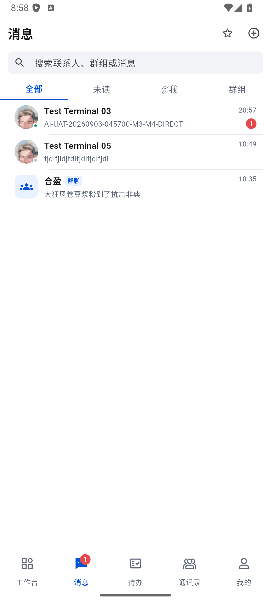
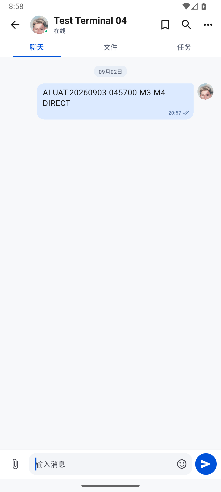
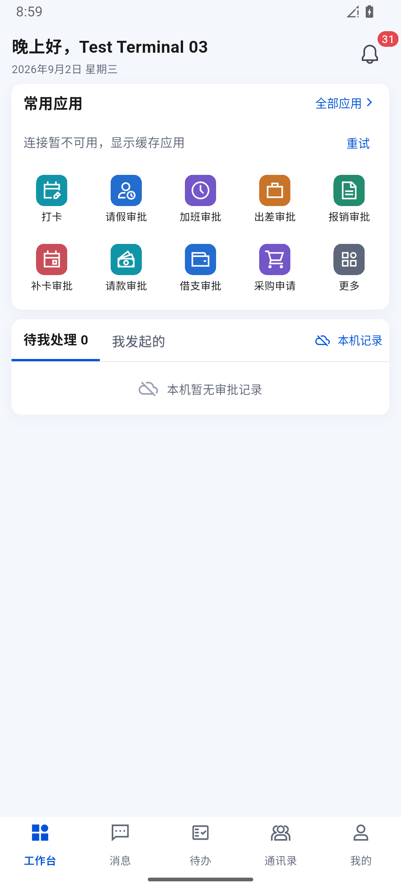
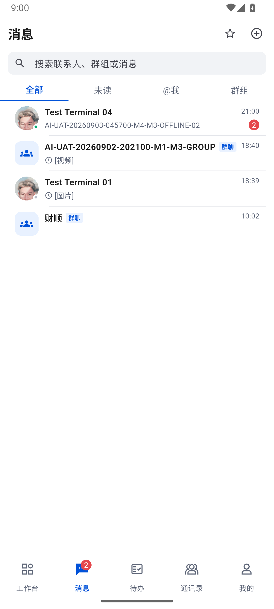
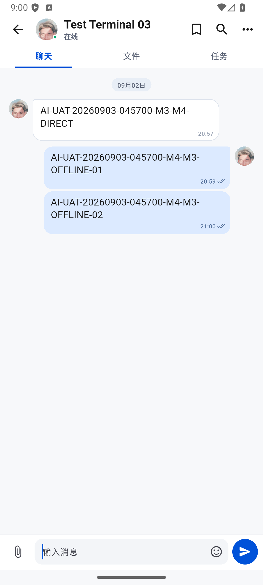
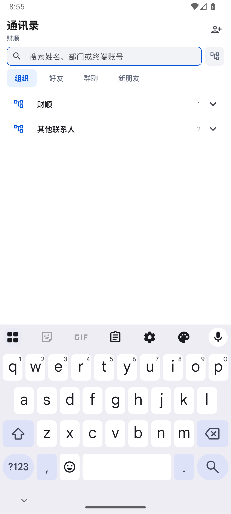
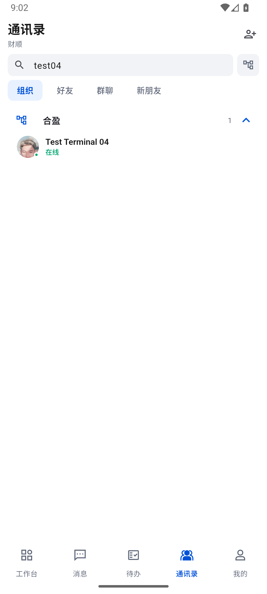
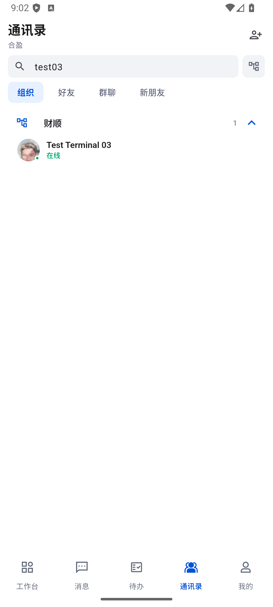

# 689 · 独立 M4、真实单聊同步及抽屉焦点修复

时间：2026-09-03 04:46–05:04，Asia/Shanghai。

## 结论及工作边界

**本轮好友申请/接受、双向单聊、未读/已读、断网冷启动补齐与数据保持通过；整体目标未完成。** 上一轮 688 有代码、运行及数据证据，属于进展。本轮新增可持续使用的独立 M4，不把真机/桌面 UI 受限当成停止其他真实验收的理由。

- M3：既有独立 `emulator-5556` / test03，Test Terminal 03，财顺。
- M4：全新本地数据目录 `E:\CodexToolchains\secureaccess-uat-avds\M4.avd`，`SecureAccess_UAT_M4` / `emulator-5558`；登录 test04，实际返回 Test Terminal 04、合盈。没有根据账号名称推断 OA 岗位。
- M4 为全新安装，不是全新服务端账号。原来已有 Test Terminal 05 好友、单聊和“合盈”群；本轮没有操作这些已有业务条目。
- M1 真机、M2 未安装、未点击、未登录、未切换网络。Windows 当前安装客户端只读检查，不冒充桌面页面操作。
- M4 使用现有 Android 16 SDK 镜像、2 GB RAM、2 核及 host GPU 参数，无界面模式；不复制 M3/M2 userdata、数据库、设备 ID 或登录令牌。[启动记录](../test/evidence/im-independent-m4-20260903/start-m4.json)、[重复启动阻止](../test/evidence/im-independent-m4-20260903/duplicate-start-check.json)。
- M4 首次系统启动约 146 秒，期间进程持续存在、boot_progress 持续前进。确认 `sys.boot_completed=1` 后才安装；没有因一次观察超时重启或重建。[完成记录](../test/evidence/im-independent-m4-20260903/boot-m4.json)。
- 数据目录当前逻辑大小 2.09 GB，E 盘剩余约 161 GB，保留 M4 继续验收：[资源记录](../test/evidence/im-independent-m4-20260903/resource-footprint.json)。

## 登录安全与账号确认

通过实际移动登录界面登录，不用 API 登录代替 UI。共享测试密码仅从当前桌面 DPAPI 保护的已保存测试凭据在内存读取，经进程环境变量传递；无明文配置、命令实参、截图或报告输出。输入采用键码，ADB 子进程启动前移除凭据环境变量。登录助手只接受独立 M3/M4 的指定测试账号，已登录时拒绝覆盖，不自动重登。

最初助手对空框发送 96 次删除键，触发自身 15 秒操作超时，**尚未输入账号或提交登录**。已去除多余清空动作，保留“必须为空的全新登录页”校验；重试实际登录成功。首次登录后一次 UI 树导出失败未复用旧图，后续重新采集成功。

[登录确认](../test/evidence/im-independent-m4-20260903/login-m4-retry.json)、[首次工作台](../test/evidence/im-independent-m4-20260903/04b-m4-home.png)、[独立账号本地元数据](../test/evidence/im-independent-m4-20260903/m4-first-login.json)。M4 账号 ID 为 `b6a2d272-aaca-4845-bbf8-294288c940a9`；M3 为 `c404c59a-6dc3-4e6b-a1dc-d5d0c20786cc`。

新增复用工具：[启动 M4](../scripts/start-uat-m4.ps1)、[安全登录包装](../scripts/login-uat-m4.ps1)、[纯 UI 环境变量登录助手](../tool/mobile_ui_login_env.mjs)。未修改桌面会话、密码或服务端配置。

## 好友链路

1. M3 通讯录 → 添加好友 → 输入 `test04`。尚未查询时为“点击查找”，没有提前显示“未找到”。查询实际返回合盈、Test Terminal 04、在线。
2. 点击“申请好友”，只发送一次。当前 UI 没有自定义验证消息字段，按产品规则生成“我是Test Terminal 03”；没有伪称可为好友申请设置 AI-UAT 前缀。
3. M4 通讯录“新朋友 1”实际出现，打开后仅接受来自 Test Terminal 03 的一条申请，没有点击“全部接受”。角标清零，提示已添加为联系人。
4. 两台好友列表都出现对方，M3 为合盈分组、M4 为财顺分组；既有 Test Terminal 01/05 好友保留。
5. M3 点击 Test Terminal 04 头像进入新单聊，空态为“发送第一条消息开始协作”，保留聊天/文件/任务边界，没有群功能混入。

证据：[查找结果](../test/evidence/im-independent-m4-20260903/06-m3-friend-result.png)、[M4 待接受](../test/evidence/im-independent-m4-20260903/09-m4-new-friend.png)、[接受后](../test/evidence/im-independent-m4-20260903/10-m4-accepted.png)、[新单聊空态](../test/evidence/im-independent-m4-20260903/14-m3-new-direct.png)。

## 三条真实消息及同步证据

新单聊 ID：`e51db063-4ed2-4a43-b7ff-bfbf32b1806d`，本地类型两端均为 `direct`。只发送以下三条测试消息，正文均以 `AI-UAT-20260903-045700` 开头；未提交新 OA 申请。

| 序号 | 方向 | 正文后缀 | clientMessageId |
| --- | --- | --- | --- |
| 1 | M3 → M4 | M3-M4-DIRECT | 0924429f-dee3-4ac6-bbd1-44d7c4ce5608 |
| 2 | M4 → 离线 M3 | M4-M3-OFFLINE-01 | 5049310a-831c-44e1-ba68-a8b77e249e2f |
| 3 | M4 → 离线 M3 | M4-M3-OFFLINE-02 | 78a37cd5-6e5d-441a-8349-a30d7d4f3c5f |

完整服务端 ID、发送者 ID、序号、创建时间和本地状态见 [M3 最终账本](../test/evidence/im-independent-m4-20260903/m3-postinstall.json) 与 [M4 最终账本](../test/evidence/im-independent-m4-20260903/m4-postinstall.json)。设备原有时区未修改；截图时间与主机记录不用于计算同步延迟。

### 第一条：不提前标读

- M3 提交后为已发送；自己的 lastRead=1、unread=0。
- M4 停留工作台时已落库 seq1，lastRead=0、unread=1，见 [打开前快照](../test/evidence/im-independent-m4-20260903/m4-before-read.json)。
- M4 打开消息列表，目标行与底部消息角标均为 1；真正进入会话可见正文后，SQLite 变为 lastRead=1、unread=0，见 [打开后快照](../test/evidence/im-independent-m4-20260903/m4-after-read.json)。
- M3 仍停留原会话，自动出现“已有接收人已读”，没有重开或手动刷新。

### 后两条：离线冷启动及未打开会话补齐

通过 [受限 UI 脚本](../scripts/uat-m3-offline-direct-m4.ps1) 仅关闭 M3 Wi-Fi/数据，确认 `Active default network: none`，强制结束并冷启动 M3。离线工作台保留登录与缓存，并明确显示连接不可用和本机记录。M4 网络未改动。

M4 在真实输入框按顺序发送两条；每次按键后都记录发送点击，不把点击当服务端确认。脚本存在运行记录时拒绝重复发送；网络恢复在 `finally` 中执行。见 [时间线](../test/evidence/im-independent-m4-20260903/offline-run.json)。

- [M3 离线快照](../test/evidence/im-independent-m4-20260903/m3-offline-before-reconnect.json)仍只有 seq1。
- 05:00:05 恢复原 Wi-Fi/数据 1/1 后，M3 留在工作台，不重开会话、不手动刷新；[打开前快照](../test/evidence/im-independent-m4-20260903/m3-reconnected-before-read.json)已有 seq1–3，lastRead=1、unread=2。
- 打开消息列表看到两条未读，进入单聊后两条完整正文按序显示，才变为 lastRead=3、unread=0。
- M4 两条均自动变为已有接收人已读。早期紧邻发送采样时一条仍处于 Outbox，最终变为 sent、Outbox=0，没有留下多一条临时消息。

## P2 修复：抽屉关闭后键盘意外恢复

真实复现：M3 搜索框曾获得焦点 → 添加好友抽屉 → 提交并关闭，原搜索框自动重新获取焦点并弹键盘，挡住列表。等待后仍存在，不是单张过渡截图误判。部门选择抽屉也有相同焦点恢复路径。

生产代码在打开这两种抽屉前显式释放当前焦点，保留原搜索词；抽屉自身输入仍可正常使用。[contacts_page.dart](../lib/features/contacts/presentation/contacts_page.dart)。

- 新增 [contact_sheet_focus_test.dart](../test/contact_sheet_focus_test.dart) 两项；[红测](../test/evidence/im-independent-m4-20260903/focus-red.log)均在“期望无焦点，实际有焦点”失败。
- [专项 18/18](../test/evidence/im-independent-m4-20260903/focus-green.log)，包含通讯录懒加载与导航守卫。
- [全量 885/885](../test/evidence/im-independent-m4-20260903/full-tests.log)、[分析 0 问题](../test/evidence/im-independent-m4-20260903/analyze.log)。
- 最终正常包上，M3 搜索 `test04` → 添加好友 → 关闭，M4 搜索 `test03` → 选择部门 → 关闭；均保留原搜索词且系统键盘状态为 false。没有额外发送好友申请或修改部门。

[M3 系统键盘核对](../test/evidence/im-independent-m4-20260903/m3-focus-result.json)、[M4 核对](../test/evidence/im-independent-m4-20260903/m4-focus-result.json)。

## 最终包与数据保持

好友及消息操作使用正常 688 包，随后将焦点修复后的正常 689 Profile 包覆盖安装到 M3 和 M4（`lib/main.dart`，arm64+x64）。[构建 54.3 秒](../test/evidence/im-independent-m4-20260903/build.log)，[两端哈希都匹配](../test/evidence/im-independent-m4-20260903/final-install.json)：

`12279FFFD50BC2B4AADDDC4C9FB5ABB85EFB8C2D3CD39E78AD720C73D18D8818`

最终包启动并完成上述真实焦点复测后，[数据比较](../test/evidence/im-independent-m4-20260903/final-data-check.json)确认：

- 两端同一新单聊均为 3 条、3 个唯一服务端 ID，序号 1/2/3；逐条 ID、clientMessageId、发送者、类型、时间、sent 状态一致。
- 两端 lastRead=3、unread=0。M3 IM applied/acked=257，M4=256；独立账号事件流无需相等。
- M3 原 test01 单聊账本不变、2 条旧待发媒体的 ID/类型/创建时间不变；不是重新发送成功。M4 Outbox=0。
- M3 2 草稿、10 已读回执原样保留；M4 自己的草稿/回执也与覆盖安装前一致。
- 两台 Wi-Fi/数据结束时均 1/1，当前 PID 的有限日志缓冲未匹配未处理异常、RenderFlex 溢出或 FATAL；不保存原始日志，也不据此宣称全场景无崩溃：[运行摘要](../test/evidence/im-independent-m4-20260903/runtime-final.json)。

M4 首次应用启动 Activity TotalTime=16094ms，最终覆盖后的 M3=2865ms、M4=7767ms；都是 ADB Activity 指标，不是页面完全就绪或帧率，M4 冷启动仍偏慢。未把额外模拟器负载下的这一轮当成性能通过。

## 未完成项与下一步

1. 本轮只新增验证单聊。M3/M4 的新测试群、入群/退群、群消息、@我、群离线补齐下一轮继续，不操作 test04 原有“合盈”群。
2. 同账号跨桌面/移动同步、双移动设备替换、D1/D2 替换、推送唤醒仍需完整矩阵；本轮不同账号不能替代这些结论。
3. [桌面前](../test/evidence/im-independent-m4-20260903/desktop-before.json)/[后](../test/evidence/im-independent-m4-20260903/desktop-after.json)当前 Windows 1.0.87/test01 的 IM/OA GET 均200，只证明这些检查时会话可用，不证明桌面窗口实时渲染或整个期间从未中断。
4. 真机、Windows 实际 UI、复杂 OA 分支/跨人审批/公式、推送和长时/大群性能仍未完成。原媒体上传500、群未读投影、撤回后任务终态问题仍保留，未自行修改服务端或将其标成已解决。
