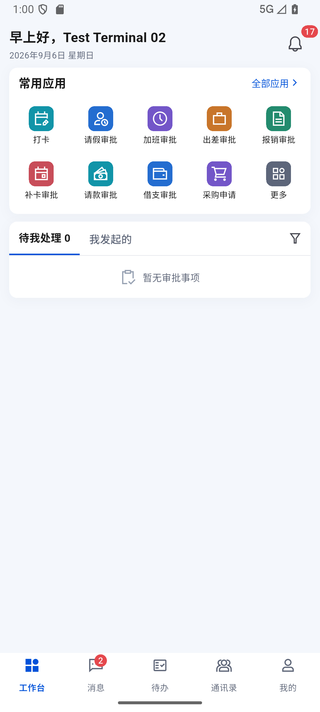
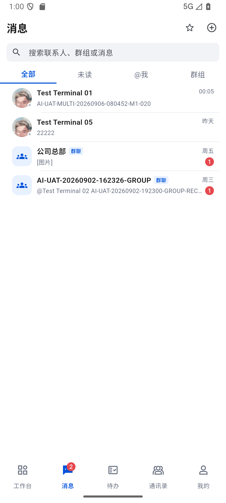
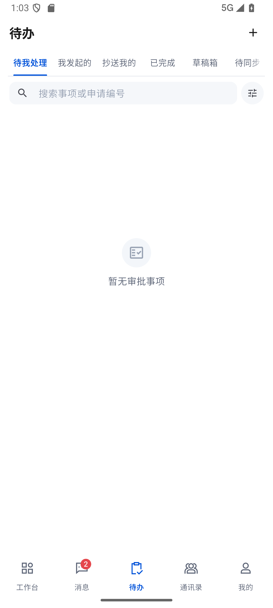
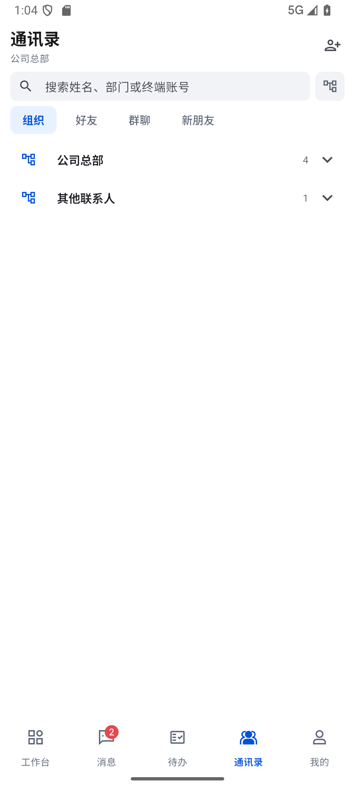
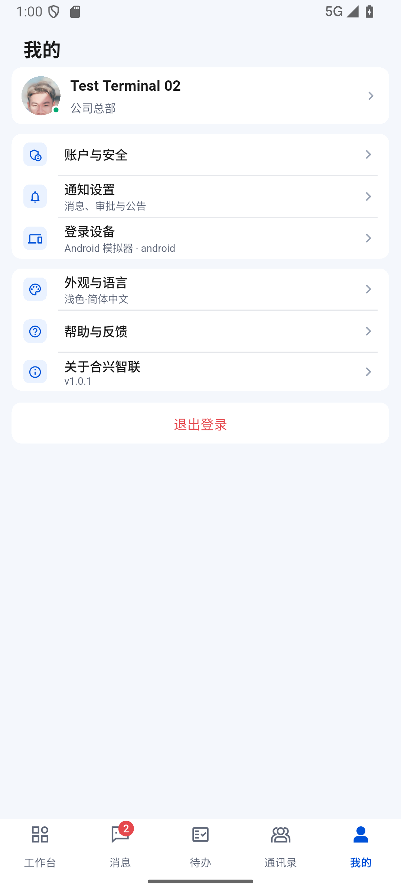

# 770 · 移动端五个主入口 UI / 交互审计

日期：2026-09-06，Asia/Shanghai。

结论：**工作台、消息、待办、通讯录、我的五个主入口已使用同一登录态逐页检查；主框架信息密度、单聊/群聊区分、通讯录默认折叠和“我的”页面均符合当前移动端方向。待办页签的点击高度从 26 dp 提升到 40 dp，同时把文字与下划线分开，视觉元素没有放大。当前为模拟器视觉与结构通过，真机交互和完整无障碍验收仍为部分通过。**

## 验收流程

1. **工作台｜健康**：公告保持在顶部紧凑区域；常用应用是 5 列移动端网格；不展示移动端打不开的常用站点；首页“去处理”保持紧凑，整行仍可点击。
2. **消息｜健康**：私聊使用成员头像，群聊使用群组图标并显示“群聊”标签；搜索、未读、@我和群组筛选没有混用；会话列表没有额外的联系按钮。
3. **待办｜修复后健康**：六个页签可横向滚动；透明点击区由 26 dp 提升为 40 dp；标签文字、徽标和下划线尺寸不变，下划线与文字的间隔增加到 8–12 dp。
4. **通讯录｜健康**：全新进程首次进入时只显示“公司总部”和“其他联系人”两个组织入口，`expandedDepartments=0`、`visibleDirectContactActions=0`；点击组织后才加载人员。展开态隐藏账号，显示头像与真实在线/最后在线状态，点击头像或成员整行进入私聊。
5. **我的｜健康**：主页面只保留账户与安全、通知设置、登录设备、外观、帮助与反馈、关于和退出登录；没有把移动端不需要的 TUN/网络状态、设备 ID 或账号明文放在主页面。

## 本轮证据

### 1. 工作台

### 2. 消息

### 3. 待办修复后

修复前截图与 UI 层级仍保留在同一证据目录，用于复核 69 px / 26 dp 的旧点击区。

### 4. 通讯录默认折叠

### 5. 我的

结构化结果见 [result.json](../test/evidence/main-shell-audit-20260906-091000/result.json)，逐页截图和 Android UI XML 均位于同一目录。

## 代码与回归

- `todos_page.dart`：页签增加稳定的 40 dp 透明触控高度，标签保持紧凑，不扩大字体、徽标或下划线。
- `oa_mobile_pages_test.dart`：新增 40 dp 点击区与 8–12 dp 下划线间距断言。
- `test/goldens/06-todos.png`：仅更新待办页经过检查的新视觉基线。
- 定向 OA 页面测试：94/94 通过。
- 全量 Flutter 测试：1405/1405 通过。
- `flutter analyze --no-fatal-infos`：0 error、0 warning；仍有 7 条既有大括号风格 info。
- Profile APK：111,236,918 字节；SHA-256 `0BBC94F4D56FF1D86A8420909AA9CB46410BC6E325472E0738E51B4D404DA544`；已保留数据覆盖安装到模拟器和 realme 真机。

## 尚未通过

1. realme 真机本轮处于锁屏，不能把模拟器截图替代为真机点击、键盘、安全区、返回手势和 TalkBack 验收；锁屏启动后的登录态、健康上报和单事件追平已单独在 [772](772-mobile-locked-device-session-catchup-20260906.md) 通过，不与 UI 验收混用。
2. 待办截图为空状态，因此只证明页签、搜索、筛选和空状态的样式；有数据时的超长标题、状态和时间密度仍需真机样本复验。
3. 部分顶部图标操作约为 40 dp。它们满足当前“不要大按钮”的视觉要求，但本轮不宣称全部达到 Android 48 dp 无障碍目标；后续可只扩展透明命中区而不放大图标。
4. 截图只能证明 UI 表现，不能代替消息多端同步、OA 流转和通知送达的协议证据；Windows 与移动端的当前事件 inbox、游标和事件 ID 对照见 [771](771-windows-mobile-event-contract-live-evidence-20260906.md)。
5. 三模拟器并发、在线 20 条突发、离线 30 条补偿及独立游标实测见 [773](773-mobile-multidevice-load-latency-plan-20260906.md)。
