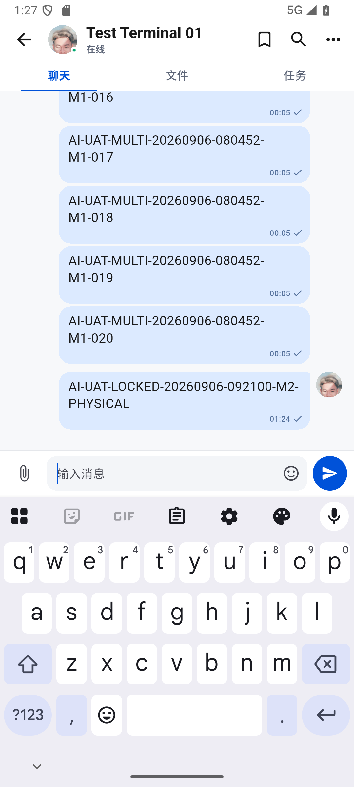

# 772 · 真机锁屏启动、会话恢复与积压事件追平

日期：2026-09-06，Asia/Shanghai。

结论：**realme RMX3366 在系统锁屏且 Dozing、应用进程不存在的情况下，由 ADB 启动应用后保留原登录态，heartbeat=204；IM/OA 均报告 `http_long_poll` 且游标健康。IM 随后补齐一条积压事件并按“落库 → 游标 → ACK”完成，SQLite 最终 event/ACK cursor 都为 4101。该样本证明锁屏启动后的会话和补偿链路可工作，但不等于厂商推送冷启动或长时间后台存活已经通过。**

## 现场过程

1. 真机处于 `mDreamingLockscreen=true`、`mWakefulness=Dozing`，应用 PID 为空。
2. 不解锁、不重新登录，通过 ADB 启动现有 MainActivity；进程启动成功。
3. 首次健康上报：heartbeat 204；IM mode=`http_long_poll`、applied/ack=4062/4062、pendingAck=0、cursorHealth=`healthy`；OA applied=820、state=`healthy`。
4. 真机收到并处理一条 IM 积压事件，sequence=4101，事件年龄约 1,988,292 ms；请求 235 ms、bootstrap 35 ms、事务提交 97 ms、ACK 1292 ms、总计 1746 ms。
5. 只读复制 SQLite/WAL 后查询并立即删除副本：IM event inbox 669 行、空 ID 0、max/event/ACK=4101/4101/4101；OA event inbox 214 行、空 ID 0、max/cursor=820/820。
6. 本轮过滤日志未发现 FATAL、ANR 或 `E/flutter`。

## 锁屏新消息及时性与离线补偿

继续保持 realme 系统锁屏，由 test02 模拟器向真机 test01 单聊发送一条 `AI-UAT-LOCKED-...` 测试消息：

1. 发送端 UI 与 SQLite 均确认只创建 1 条服务端消息，发送时间 09:24:46.869。
2. 真机在锁屏后台观察 45 秒，没有新的同步阶段日志，目标消息未落库，event/ACK cursor 均停在 4101。
3. 在仍不解锁的情况下显式重启应用进程，heartbeat 仍为 204；随后收到 `message.created` event 4120，内部追平总耗时 924 ms，event/ACK cursor 同步推进到 4120。
4. 用服务端消息 ID 跨设备比对，发送端 1 条、接收端 1 条，双方会话内 sequence 都为 253，无丢失、无重复。
5. 接收端仍锁屏、消息没有进入可见区域，发送端保持单勾未读；锁屏补偿没有误提交已读。

这把两个结论明确分开：当前移动端的离线补偿、幂等和可见已读语义通过；应用退到锁屏且没有可用厂商推送唤醒时，新消息不会仅凭“服务端推送能力已接入”自动到达。后者继续保持未通过，不能包装成实时推送已经完成。

结构化证据：[result.json](../test/evidence/locked-device-catchup-20260906-095000/result.json)。没有保留包含消息正文、账号 ID、Token、设备 ID 或附件地址的数据库副本。

## 判定边界

- 锁屏状态下恢复既有会话：通过。
- 启动后的 IM/OA 长轮询健康上报：通过。
- IM 积压事件持久化与 ACK：通过（单事件样本）。
- 厂商推送唤醒被杀进程：未执行；当前厂商通道仍标记待接入。
- 锁屏后台实时送达：未通过；真实新消息等待 45 秒没有落库，显式启动后才补齐。
- Android 长时间 Doze 后后台存活和周期心跳：未通过，本轮是 ADB 主动启动。
- 真机五个主入口、键盘、返回手势、安全区和 TalkBack：未通过，系统锁屏无法操作。
