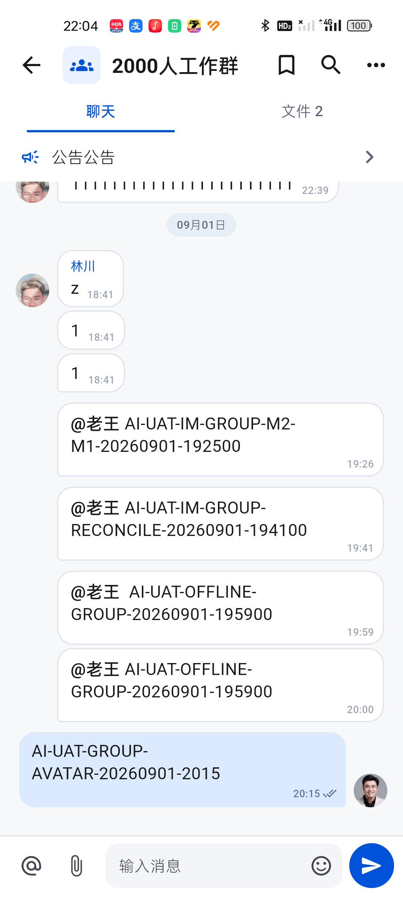
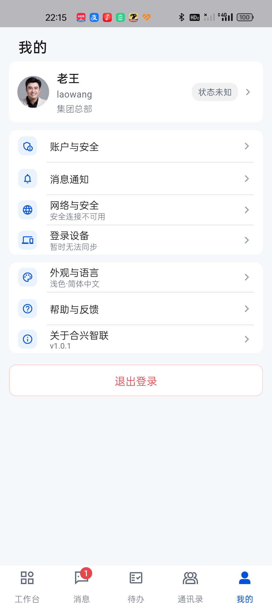
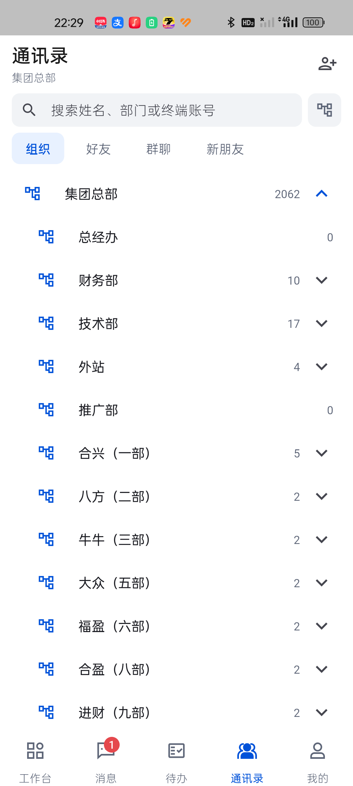
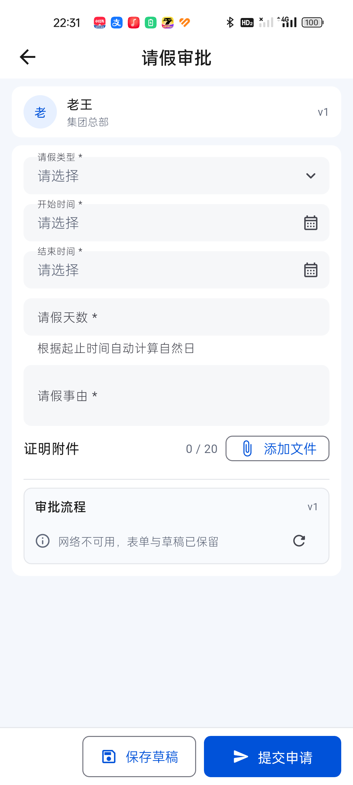
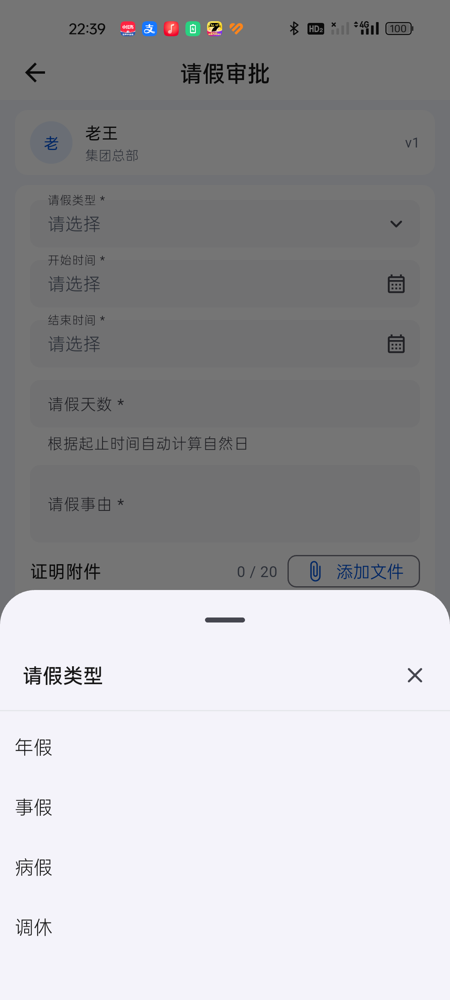
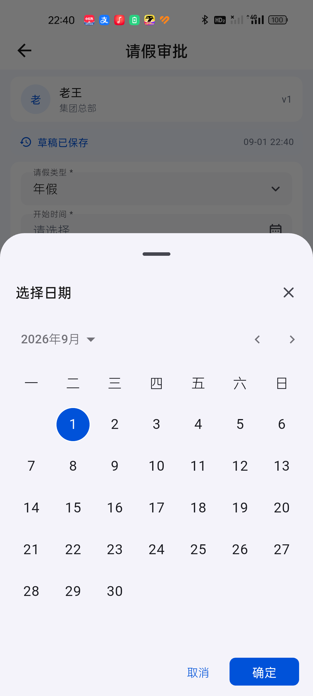
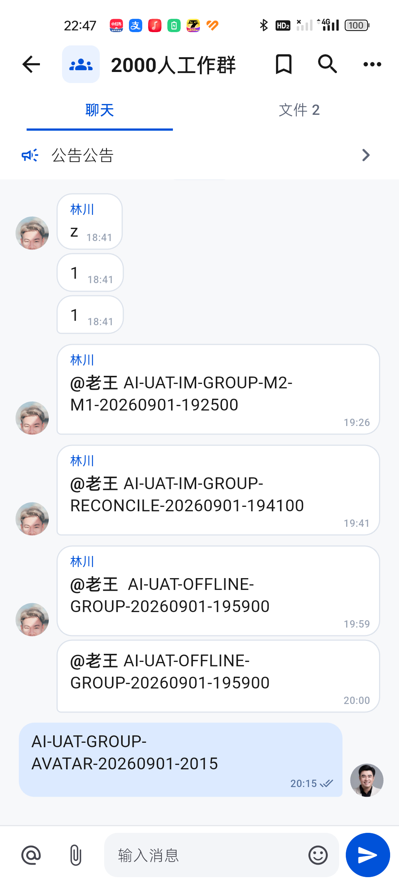
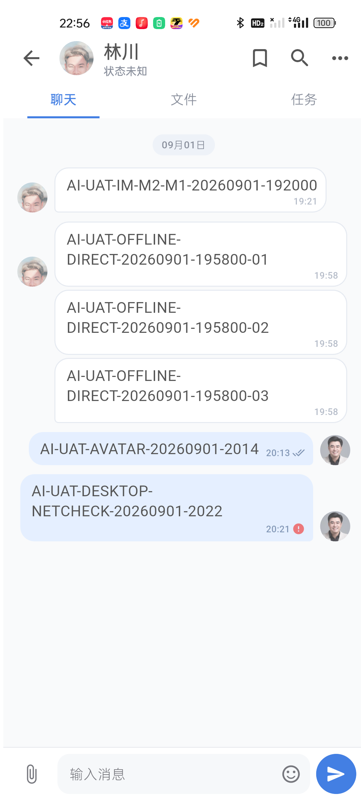
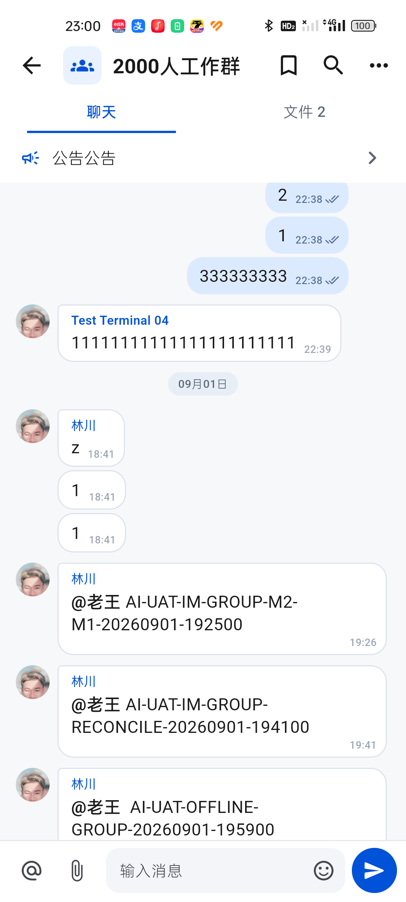

# 移动端断网状态续查（2026-09-01）

## 待办指示条与“我的”密度

- 待办激活指示条已与文字拉开，并增加 4–6dp 的几何断言。
- “我的”资料卡只显示姓名与部门；在线状态改为紧凑圆点文字，账号仍可在“账户与安全”查看。
- 退出登录收回到设置卡片层级，不再作为醒目的描边表单按钮。
- 真机证据：`52-todo-tab-indicator-stable-after-real.png`、`55-profile-compact-stable-after-real.png`、`53-todo-tab-source-after-comparison.png`、`56-profile-stable-before-after-comparison.png`。

## “我的”内部设置页

- 真机逐页检查了账户与安全、消息通知、网络与安全、登录设备、外观与语言、帮助与反馈、关于合兴智联。
- 密码输入框压缩到不超过 40dp，确认按钮为 118 × 36dp；功能、独立显隐按钮和密码校验保持不变。
- 服务不可用时，账户状态改为“已验证·状态未知”，不再把缓存在线状态显示为实时在线。
- 消息通知加载改为 52dp 的紧凑离线状态行，提供重试，不再显示大面积空卡和持续转圈。
- 关于页品牌区压缩到 110dp 以内，版本、检查更新、平台和策略信息不变。
- 真机证据：`66-account-security-true-offline-final-real.png`、`67-notification-offline-final-real.png`、`68-about-compact-final-real.png`；对比图为 `69-account-security-before-after.png`、`70-notification-before-after.png`、`71-about-before-after.png`。

## 范围

- 设备：realme RMX3366，1080 × 2400。
- 场景：测试环境 HTTP 请求持续超时，应用保留登录态和本地 IM 数据。
- 目标：确认聊天、个人页和登录设备页在断网时不会伪在线、丢缓存或永久加载；核对 2000 人通讯录的移动端层级与按需渲染。

## 步骤与结果

1. 群聊缓存：健康。历史消息、真实头像、时间和发送状态均可读取；断网没有触发整页重渲染或清空。

   

2. 个人页设备状态：调整前不健康，接口持续挂起时一直显示“正在同步设备”；调整后健康，连接尚未可用时立即显示“暂时无法同步”。

   

3. 登录设备详情：调整前不健康，超过接口超时窗口仍显示大号转圈；调整后健康，使用一行紧凑断网状态和重试入口。

   

4. 重试与恢复：健康。点击后显示“重试中…”，12 秒超时后恢复“重试”，没有重复弹窗、原始异常或永久禁用。

   

   

5. 通讯录首屏：调整前按完整部门路径平铺全部有人员的部门，重复前缀多且首屏需要创建大量部门项；调整后默认只显示顶层“集团总部”和后代人数，不创建人员行。

   

6. 部门展开：点击顶层后只展示直接下级部门，部门名称不再重复“集团总部 / …”路径；零人员且无下级的部门不显示无效展开箭头。

   

7. 人员按需渲染：继续展开具体部门后才创建该部门人员行，人员账号保持隐藏，头像和整行均可进入单聊；实时通道不可用时明确显示“状态未知”，不冒充在线。

   

8. OA 动态表单：真机逻辑尺寸下，单行输入与选择控件约 38dp、底部主按钮 42dp；断网后审批流程在原页显示紧凑提示，表单和草稿均保留。

   

9. OA 选择交互：下拉选项和日期均使用向上展开的移动端抽屉，不出现居中业务弹窗；单选保留当前项勾选，日期选择保留取消和确认动作。

   

   

10. 错误文案：登录、IM、通讯录、通知、待办、审批、考勤、设置、网络安全和工作台的展示层已统一使用短错误映射；保留动作名称，不展示 URL、`/api/`、Token、Dio/Socket 类型或堆栈。

11. 聊天头像分组：同一发送人在 5 分钟内的连续消息合并为一组，昵称和头像只放在组首；相邻消息间隔超过 5 分钟后重新显示头像。真机断网缓存复验中，18:41 的三条消息只在首条显示头像，19:26、19:41、19:59 分别开始新组，19:59–20:00 的连续两条只显示一次头像。

   

12. 会话打开性能：10 次消息列表热重开共呈现 269 帧，SurfaceView `droppedFrames=0`；10 次“通讯录搜索键盘打开 → 已有单聊”修正后共呈现 295 帧，`droppedFrames=0`。点击联系人现在先清理搜索焦点并隐藏输入法，50ms 内历史消息已经出现，150ms 时键盘完全退场。

   

   详细数据见 [contact-chat-performance-summary.md](contact-chat-performance-summary.md)。

13. 消息组视觉关系：头像移到组首后，气泡原先仍在组尾保留尖角且头像按底部对齐，发送人指向不一致。现已把头像改为与组首气泡顶部对齐，并把 4dp 识别角移到组首；后续连续气泡保持完整圆角。真机缓存群聊与聊天黄金图均已复核。

   

## 设计与可访问性结论

- 状态、图标和操作保持在同一行，避免大面积空白加载卡；按钮尺寸和现有移动端设置页一致。
- 状态不再依赖颜色表达，离线图标与文字同时出现；重试具有明确文本标签。
- 通讯录使用“顶层部门 → 下级部门 → 人员”的渐进展开结构，首屏信息密度更低，长组织名称不再因完整路径重复而大量截断。
- OA 业务选择沿用统一底部抽屉，紧凑输入与固定底部动作保持同一视觉密度；错误反馈不再以技术异常占据页面。
- 聊天头像按短时间消息组显示在首条，既保留发送人识别，也避免同一天相隔很久的消息被错误合并。
- 通讯录搜索到已有单聊使用本地会话直达；导航前主动收起输入法，避免键盘覆盖新页面造成拖影和“卡住”感。
- 头像、昵称和气泡识别角统一绑定消息组首，长文本也不会出现头像落在气泡底部、尖角留在组尾的错位。
- 截图只能证明视觉、触控路径和时间收口，不能证明读屏顺序或服务端恢复后的最新设备清单。

## 未完成边界

- 测试环境恢复后需验证：缓存设备列表显示、当前设备识别、撤销其他设备、在线重试恢复以及个人页摘要自动更新。
- 测试环境恢复后需复测部门人数与在线状态的实时刷新，并从通讯录点击既有联系人验证服务端恢复后的跨端会话同步。
